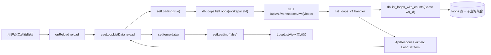
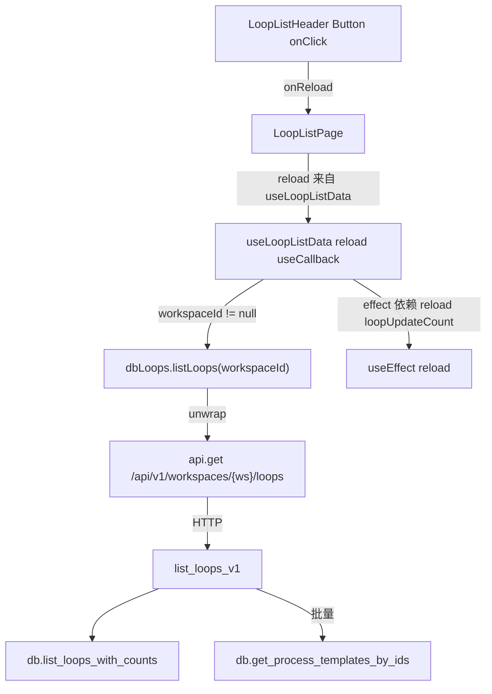
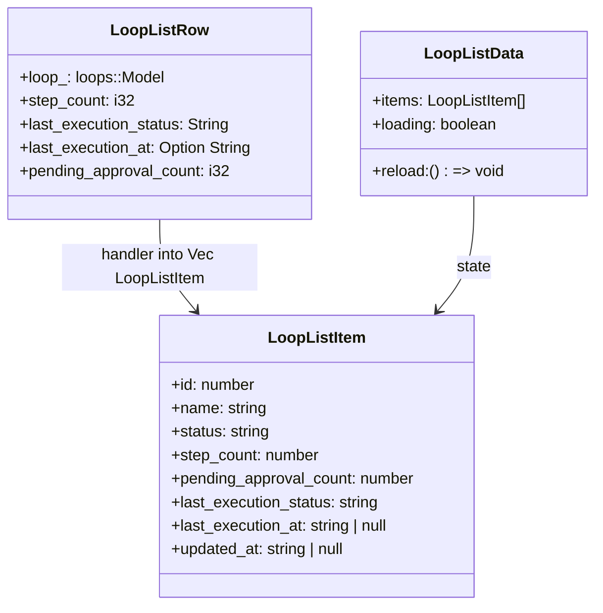
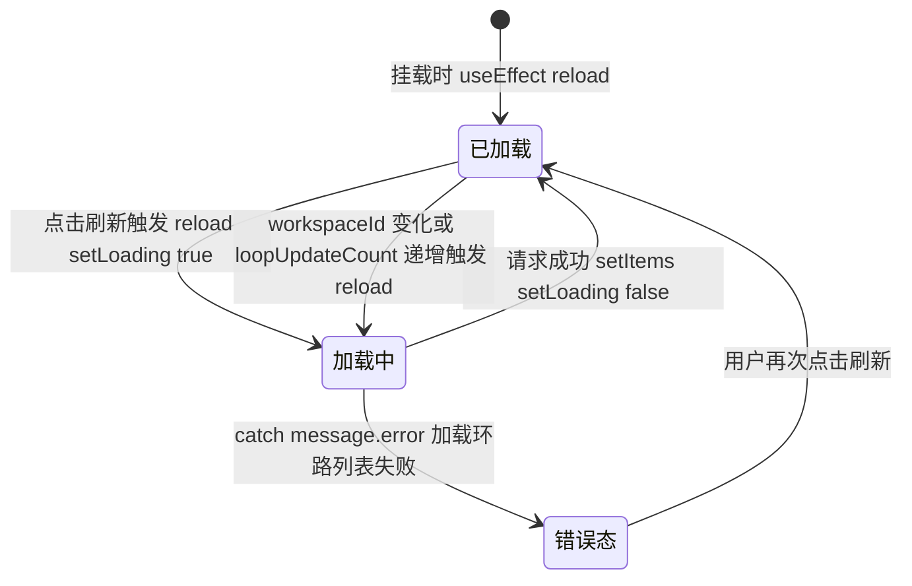

# 刷新列表

## 功能位置

环路（列表） → 顶部 `PageCard` 的 `extra` 区 → `LoopListHeader` 「刷新」按钮（`Button` 带 `ReloadOutlined`，`aria-label="刷新"`，`loading` 绑定数据加载态）。

## 数据流图（前端 → 后端）

## 调用关系链路图

## 数据结构图

## 数据变更图

## 开发指导

- **前端入口**：`frontend/src/components/loop-list/LoopListPageParts.tsx` 的 `LoopListHeader`（刷新 `Button` `onClick={onReload}`），`reload` 由 `frontend/src/components/loop-list/index.tsx` 的 `useLoopListData` 提供（`useCallback` 包裹 `dbLoops.listLoops`），`loading` 绑定按钮 `loading` prop。
- **后端入口**：`backend/src/handlers/loop_.rs` 的 `list_loops_v1`（路由 `GET /api/v1/workspaces/{ws}/loops` 见 `v1_routes`），DAO `backend/src/db/loop_.rs` 的 `Database::list_loops_with_counts`。
- **注意**：`reload` 用 `useCallback` 保证引用稳定，避免 `useEffect([reload, loopUpdateCount])` 依赖循环；`workspaceId == null` 时直接 `setItems([])` 短路不发请求；后端原生 SQL 按 `id DESC` 排序（054 起与 task/todo 一致），并含 `step_count`/`last_execution_status`/`last_execution_at`/`pending_approval_count` 四个子查询聚合。
- **扩展**：要加服务端分页/排序，在 `listLoops` 增 `page`/`sort` 查询参数，`list_loops_v1` 解析后改 `list_loops_with_counts` 的 `ORDER BY` 与 `LIMIT/OFFSET`；当前前端用 `Table` 的 `pagination`（`pageSize:20`）做客户端分页。
