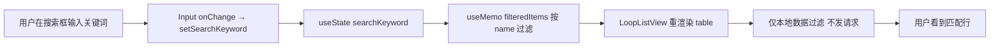
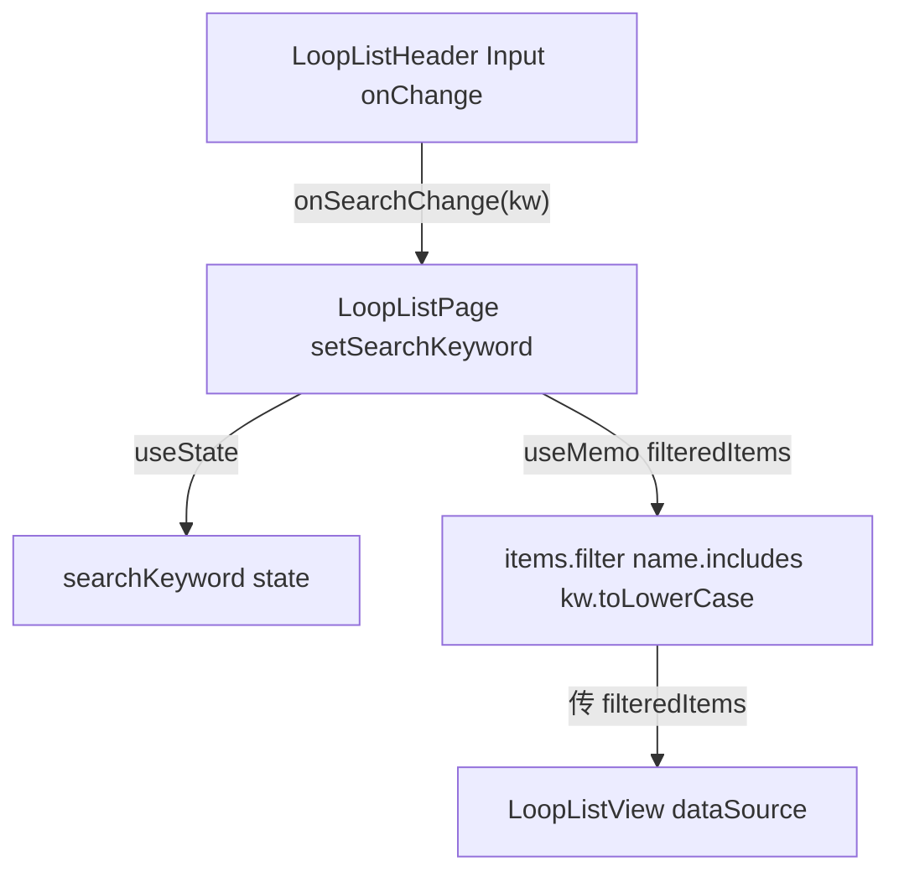
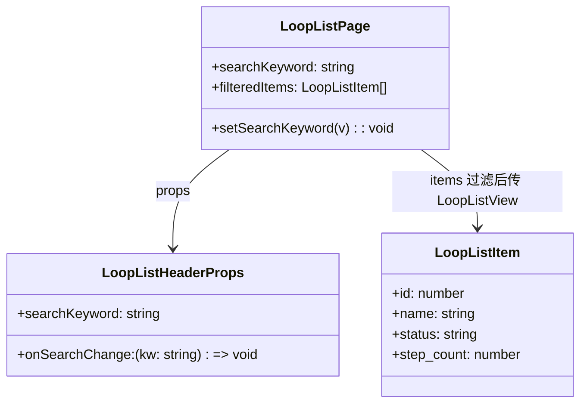
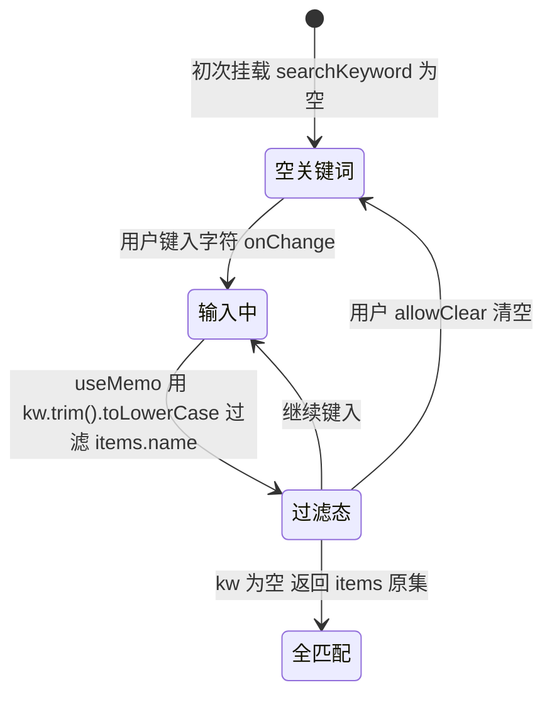

# 搜索环路

## 功能位置

环路（列表） → 顶部 `PageCard` 的 `extra` 区 → `LoopListHeader` 搜索框（`Input` 带 `SearchOutlined` 前缀，`data-testid="loop-list-search"`）。

## 数据流图（前端 → 后端）

## 调用关系链路图

## 数据结构图

## 数据变更图

## 开发指导

- **前端入口**：`frontend/src/components/loop-list/LoopListPageParts.tsx` 的 `LoopListHeader` 组件（`Input` `onChange`），关键词 state 与过滤在 `frontend/src/components/loop-list/index.tsx` 的 `LoopListPage`（`useState` + `useMemo`）。
- **后端入口**：无。搜索是纯前端对已拉取的 `items` 按 `name` 子串过滤，不发请求。
- **注意**：过滤口径是 `(l.name || '').toLowerCase().includes(kw.trim().toLowerCase())`，空关键词时直接返回原 `items`；`name` 可能为空字符串，用 `|| ''` 兜底避免 `toLowerCase` 报错。
- **扩展**：要改为服务端搜索，需在 `dbLoops.listLoops` 加查询参数并在后端 `list_loops_v1` 的 `list_loops_with_counts` 原生 SQL 增 `WHERE l.name LIKE ?` 分支；要按状态/标签过滤则在 `filteredItems` 的 `useMemo` 里加判定即可。
