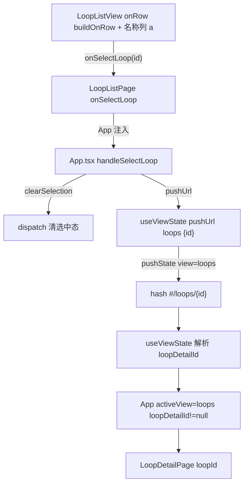
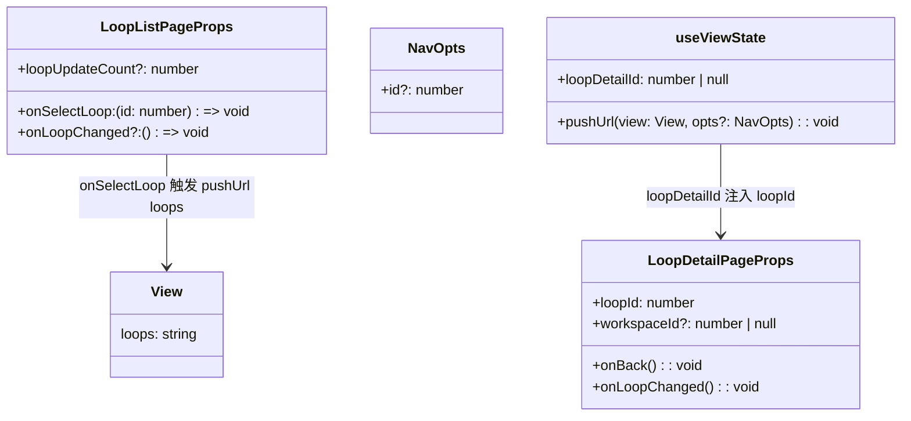
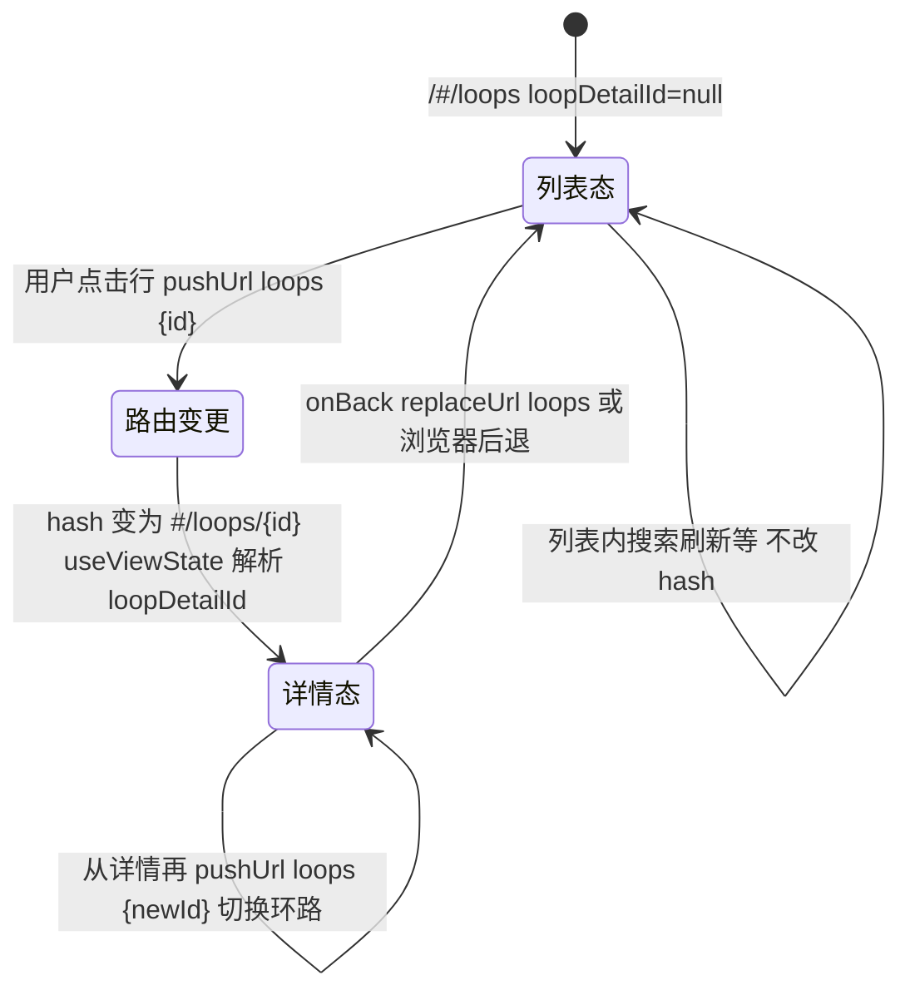

# 跳转环路详情

## 功能位置

环路（列表） → `LoopListView` Table 行点击（`onRow` → `onSelectLoop(record.id)`）或「名称」列单元格内的 `<a>` 链接（`onClick` 内 `e.stopPropagation()` 后调 `onSelectLoop(record.id)`）。

## 数据流图（前端 → 后端）

## 调用关系链路图

## 数据结构图

## 数据变更图

## 开发指导

- **前端入口**：`frontend/src/components/loop-list/LoopListViewParts.tsx` 的 `buildOnRow`（整行 `onClick` → `onSelectLoop`）与名称列 `<a>`（`onClick` 内先 `e.stopPropagation()` 避免冒泡），`onSelectLoop` 由 `frontend/src/components/loop-list/index.tsx` 的 `LoopListPage` 透传，最终落到 `frontend/src/App.tsx` 的 `handleSelectLoop`（`clearSelection` + `pushUrl('loops', { id: loopId })`）。
- **后端入口**：本功能点不发请求，仅前端路由切换。详情态挂载后由 `LoopDetailPage` → `LoopDetailPanel.reload` 拉 `GET /api/v1/workspaces/{ws}/loops/{id}`。
- **注意**：名称列链接的 `onClick` 必须 `e.stopPropagation()`，否则会先触发行 `onRow.onClick`（两者都调 `onSelectLoop`，虽结果一致但会重复触发父组件 `clearSelection`/`pushUrl`）；`buildRowActions` 的菜单项也各自 `domEvent.stopPropagation()` 挡冒泡避免误跳详情。
- **扩展**：要改为携带 tab 预选（如直接打开执行历史），在 `NavOpts` 加 `tab` 字段，`pushUrl('loops', { id, tab })` 在 `useViewState` 拼 query 段，`LoopDetailPage` 解析后透传给 `LoopDetailPanel` 的 `Collapse defaultActiveKey`。
