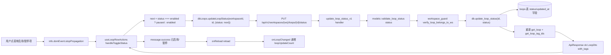
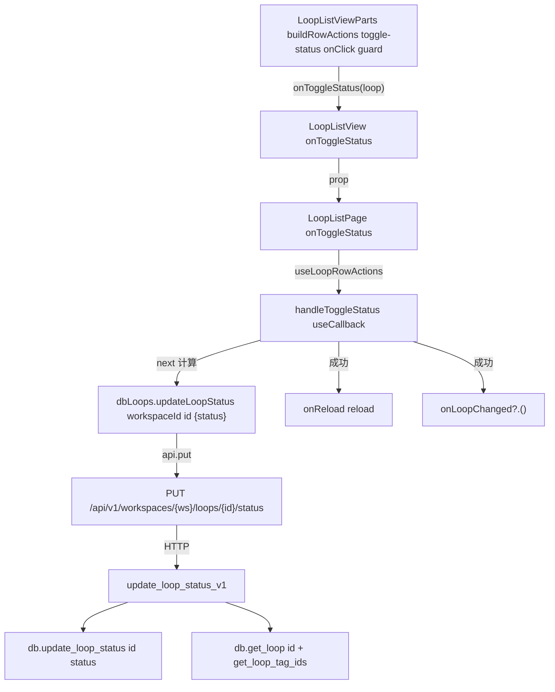
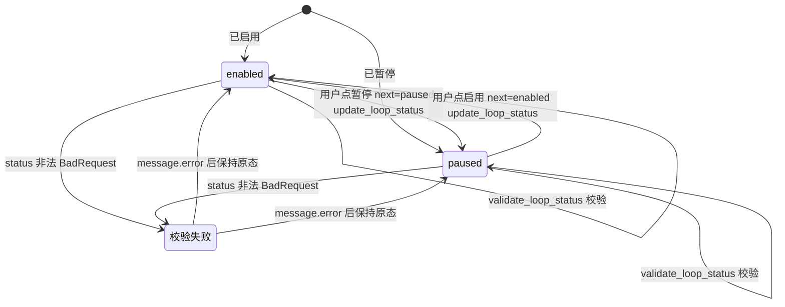

# 启停切换

## 功能位置

环路（列表） → `LoopListView` Table 行尾「操作」列 → `MoreOutlined` `Dropdown` 菜单「启用/暂停」项（`SettingOutlined`，文案随当前 `status` 切换）。

## 数据流图（前端 → 后端）



## 调用关系链路图



## 数据结构图

```mermaid
classDiagram
  class LoopListItem {
    +id: number
    +status: string
  }
  class UpdateLoopStatusRequest {
    +status: LoopStatus | string
  }
  class LoopStatus {
    enabled: string
    paused: string
  }
  class loops::Model {
    +id: i64
    +status: String
    +updated_at: Option String
  }
  UpdateLoopStatusRequest --> LoopStatus : status 取值
  LoopListItem --> UpdateLoopStatusRequest : 请求体
```

## 数据变更图



## 开发指导

- **前端入口**：`frontend/src/components/loop-list/LoopListViewParts.tsx` 的 `buildRowActions`（`key: 'toggle-status'`，label 随 `loop.status` 切换「启用/暂停」），回调 `frontend/src/components/loop-list/LoopListPageParts.tsx` 的 `useLoopRowActions.handleToggleStatus`。
- **后端入口**：`backend/src/handlers/loop_.rs` 的 `update_loop_status_v1`（路由 `PUT /api/v1/workspaces/{ws}/loops/{id}/status`），先 `models::validate_loop_status` 校验枚举再 `workspace_guard::verify_loop_belongs_to_ws` 校验归属，DAO `backend/src/db/loop_.rs` 的 `Database::update_loop_status`（按 id 取 existing 转 `ActiveModel`，`Set status` + `Set updated_at=utc_timestamp` 后 `update`）。
- **注意**：前端只在 `enabled`/`paused` 二态间翻转（`disabled` 是展示态不参与切换），后端 `validate_loop_status` 校验只允许这两个枚举；catch 提示「状态切换失败」并带错误信息；切换后 `onReload` 重拉列表让 `Table` 的状态 Tag 与行菜单文案同步。
- **扩展**：要加新状态（如 `disabled`），需在 `backend/src/models/loop_.rs` 的 `validate_loop_status` 加枚举项，前端 `frontend/src/types/loop.ts` 的 `LoopStatus` 加类型，`frontend/src/components/loop-list/LoopListViewParts.tsx` 的 `LOOP_STATUS_META` 加中文/颜色映射，并改 `handleToggleStatus` 的 `next` 计算口径。
