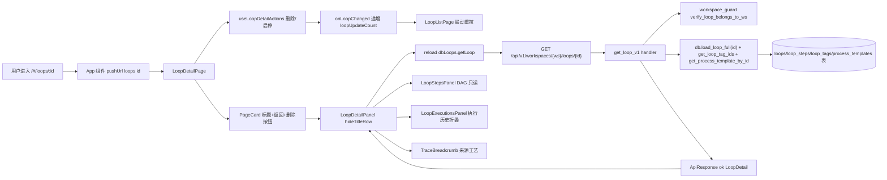

# 环路（详情）

> 页面级总览。本页各功能点的 4 图 + 开发指导在子文档中维护。

## 页面简介

环路详情页是 `/#/loops/:id` 路由对应的独立页容器 `LoopDetailPage`（URL 带 `:id` 段时挂载）。044 环路瘦身后，触发/复制/导出/编辑按钮已整体下线——详情页只保留返回列表、删除（`LoopDetailActions` 内 `Popconfirm`）、启停切换（基本信息区 `Switch`）、跳转来源工艺（`TraceBreadcrumb`）、查看执行环节（`LoopStepsPanel` DAG 流程图，只读）、流程图节点跳转事项与折叠的执行历史（`LoopExecutionsPanel`）。

页面用 `PageCard` 包裹 `LoopDetailPanel`，顶部标题 `环路 #id` + 标题右侧「返回列表」按钮 + `extra` 右上角删除按钮。删除按钮上下文由 `LoopDetailPanel` 通过 `onActionsReady` 回调上报就绪标志位（避免 `hideTitleRow=true` 隐藏内层标题行时按钮连带消失）。操作回调拆到 `useLoopDetailActions` hook，完成后经 `onLoopChanged` 通知父组件递增 `loopUpdateCount`，联动刷新 `LoopListPage`。

详情数据由 `LoopDetailPanel` 内部 `reload` 拉取：调用 `dbLoops.getLoop(workspaceId, loopId)`，后端走 `GET /api/v1/workspaces/{ws}/loops/{id}` → `get_loop_v1` handler → `workspace_guard::verify_loop_belongs_to_ws` 校验归属 → `db.load_loop_full(id)`（含 steps/todo_map）+ `db.get_loop_tag_ids(id)` + `db.get_process_template_by_id` 注入来源工艺名/guid/version。面板还预加载 `dbLoops.listExecutions(..., {page:1,limit:1})` 取执行历史总数供折叠标签展示，并用 `latestLoopIdRef` 防切换竞态丢弃 stale 响应。

## 页面级数据流总图

## 功能点索引

- [返回列表](loop-detail-back)
- [删除环路](loop-detail-delete)
- [启停切换](loop-detail-toggle-status)
- [跳转来源工艺](loop-detail-open-process)
- [步骤展开/执行环节查看](loop-detail-steps-expand)
- [流程图节点跳转事项](loop-detail-open-todo)
