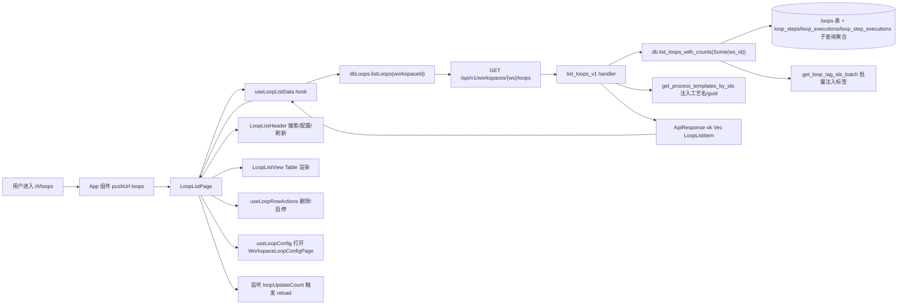

# 环路（列表）

> 页面级总览。本页各功能点的 4 图 + 开发指导在子文档中维护。

## 页面简介

环路列表页是 `/#/loops` 路由对应的独立页容器 `LoopListPage`（URL 不带 `:id` 段时挂载）。044 环路瘦身后，环路降级为「工艺的运行时承载」——手工新建/触发/复制入口已整体下线，列表页只负责展示当前工作空间下的全部环路、按名称即时搜索、打开工作空间环路配置页（评审模板管理），以及对单行做删除与启停切换。环路只能由工艺 install/upgrade 产生。

页面顶部 `PageCard` 的 `extra` 渲染 `LoopListHeader`（搜索框 + 配置按钮 + 刷新按钮），主体是 `LoopListView`（Ant Design `Table` 形态），列含 ID、名称、工艺、状态、标签、环节数、待审批数、最近执行状态/时间、更新时间与行操作菜单。顶部工具栏还提供批量操作按钮（复用 `useBatchActions` 的 `loop` 模式）与已选计数。

数据由 `useLoopListData` hook 按当前 `workspaceId` 拉取：调用 `dbLoops.listLoops(workspaceId)`，后端走 `GET /api/v1/workspaces/{ws}/loops` → `list_loops_v1` handler → `db.list_loops_with_counts(Some(ws_id))` 原生 SQL（含 `step_count`/`last_execution_status`/`last_execution_at`/`pending_approval_count` 子查询聚合）。列表还监听父组件维护的 `loopUpdateCount` 信号，环路详情页删除/启停后递增该计数触发列表重拉，形成跨页联动刷新。

## 页面级数据流总图

