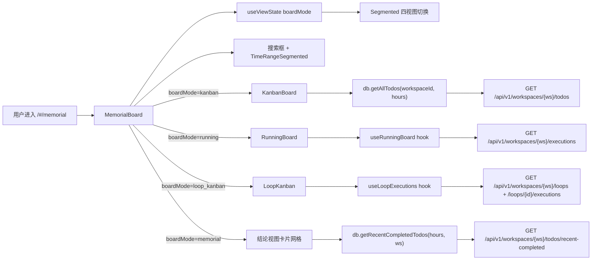

# 看板

> 页面级总览。本页各功能点的 4 图 + 开发指导在子文档中维护。

## 页面简介

看板页（`MemorialBoard`）是 `/#/memorial` 路由对应的看板容器，顶部 `PageCard` 的 `extra` 渲染 `Segmented` 四视图切换器（看板视图 / 运行视图 / 环路视图 / 结论视图），主体根据 `boardMode` 分别渲染 `KanbanBoard`（todo 维度状态流转看板）、`RunningBoard`（实时运行状态监控）、`LoopKanban`（环路执行历史看板）或结论视图卡片网格。

`boardMode` 由 `useViewState` 管理，通过 URL `?mode=` query 同步，支持浏览器前进后退。四种视图共享 `hours`（时间窗）和 `searchText`（搜索关键字）状态——用户切换视图时保持筛选条件避免重复输入。工具栏含搜索框（`Input` + `SearchOutlined`）和 `TimeRangeSegmented`（6h / 24h / 72h / all 分段），项目过滤已移除（工作空间切换由 `WorkspaceSwitcher` 统一管理）。

数据按 `state.selectedWorkspace` 隔离：结论视图调用 `db.getRecentCompletedTodos(hours, workspaceId)` → `GET /api/v1/workspaces/{ws}/todos/recent-completed`；看板视图调用 `db.getAllTodos(workspaceId, hours)` → `GET /api/v1/workspaces/{ws}/todos`；运行视图通过 `useRunningBoard` hook 调用 `GET /api/v1/workspaces/{ws}/executions` + `GET /api/v1/workspaces/{ws}/todos/scheduled`；环路视图通过 `useLoopExecutions` hook 调用 `dbLoops.listLoops` + `dbLoops.listExecutions`。

## 页面级数据流总图

## 功能点索引

- [视图模式切换（四视图）](board-mode-switch)
- [搜索任务](board-search)
- [时间窗过滤](board-time-filter)
- [切换历史运行记录](board-run-history-switch)
- [展开/收起卡片详情](board-expand-toggle)
- [跳转事项详情](board-open-todo)
