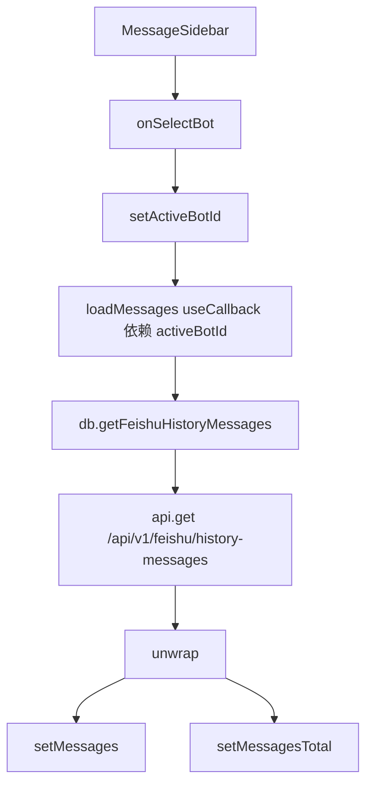
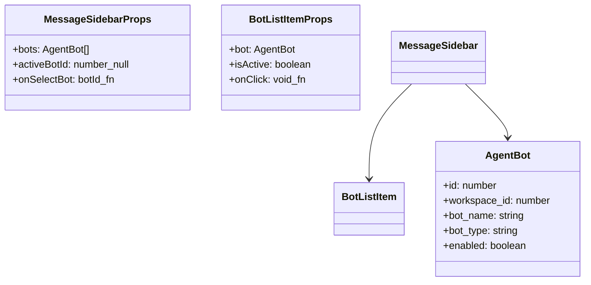
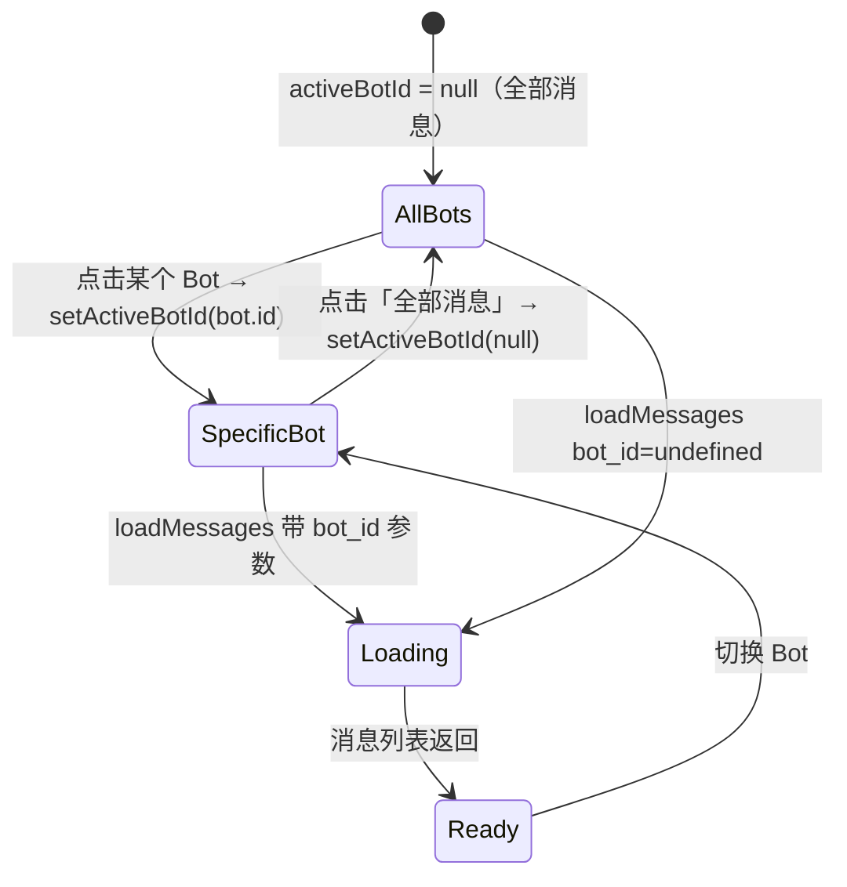

# 按 Bot 筀选

## 功能位置

消息页 → 桌面端左侧 `MessageSidebar` 的 Bot 列表项；移动端 Bot 筛选按钮组

## 数据流图（前端 → 后端）

```mermaid
flowchart LR
  U[用户点击 Bot 列表项] --> SB["MessageSidebar onSelectBot / setActiveBotId"]
  SB --> AB["setActiveBotId(botId 或 null)"]
  AB --> LM["loadMessages 被依赖触发"]
  LM --> DB["db.getFeishuHistoryMessages(bot_id 参数)"]
  DB --> API["GET /api/v1/feishu/history-messages?bot_id=N"]
  API --> H[get_history_messages handler]
  H --> DAO["db 查询 feishu_messages 表 按 bot_id 过滤"]
  DAO --> RES[筛选后的消息列表]
  RES --> SM["setMessages / setMessagesTotal"]
```

## 调用关系链路图

## 数据结构图

## 数据变更图

## 开发指导

- **前端入口**：`frontend/src/components/message-monitor/MessageSidebar.tsx` 的 `MessageSidebar` 和 `BotListItem` 组件；移动端在 `MessagesPage.tsx` 内联渲染按钮组
- **后端入口**：`backend/src/handlers/feishu_history.rs` 的 `get_history_messages` handler，通过 `HistoryMessagesQuery.bot_id` 参数过滤
- **注意**：`activeBotId` 为 `null` 表示「全部消息」，传给后端时 `bot_id` 为 `undefined`（不发送该参数），后端不会按 bot_id 过滤；Bot 列表已按 `workspace_id` 筛选，侧边栏只展示当前工作空间的 Bot
- **扩展**：若需要展示 Bot 的在线状态或最近消息时间，在 `AgentBot` 接口追加字段并在 `BotListItem` 中渲染状态点；新增筛选维度时在 `MessageSidebar` 增加选择器并在 `loadMessages` 参数中透传
