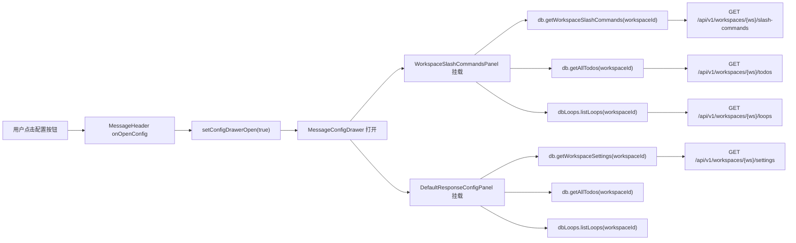
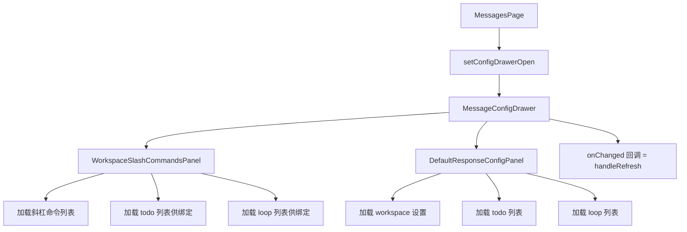
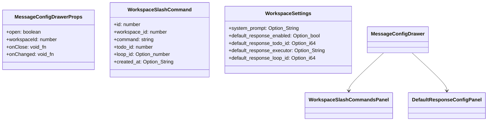
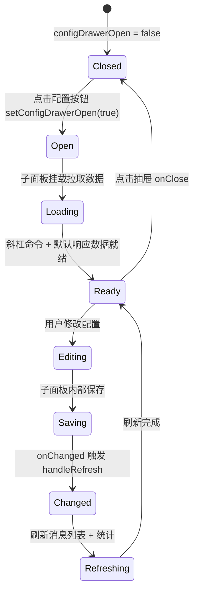

# 打开消息配置抽屉

## 功能位置

消息页 → 顶部 `MessageHeader` 的「配置」按钮（`SettingOutlined`）

## 数据流图（前端 → 后端）

## 调用关系链路图

## 数据结构图

## 数据变更图

## 开发指导

- **前端入口**：`frontend/src/components/message-monitor/MessageConfigDrawer.tsx` 的 `MessageConfigDrawer` 组件，由 `MessagesPage` 的 `onOpenConfig` 控制
- **后端入口**：`backend/src/handlers/workspace_slash_command.rs`（斜杠命令 CRUD）和 `backend/src/handlers/workspace_setting.rs`（工作空间设置读写）
- **注意**：`MessageConfigDrawer` 用 `destroyOnClose` 保证每次打开时子面板重新挂载拉取最新数据；`onChanged` 回调绑定到 `handleRefresh`，保存配置后会自动刷新消息列表与统计，不要额外再绑一次刷新
- **扩展**：若要在配置抽屉中新增配置面板，在 `MessageConfigDrawer` 的 JSX 内追加新分区（Divider 分隔），传入 `workspaceId` 和 `onChanged` 即可；新增配置字段时同步更新 `WorkspaceSettings` 接口和后端 `workspace_settings` 表 migration
