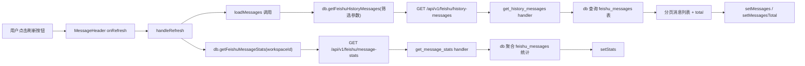
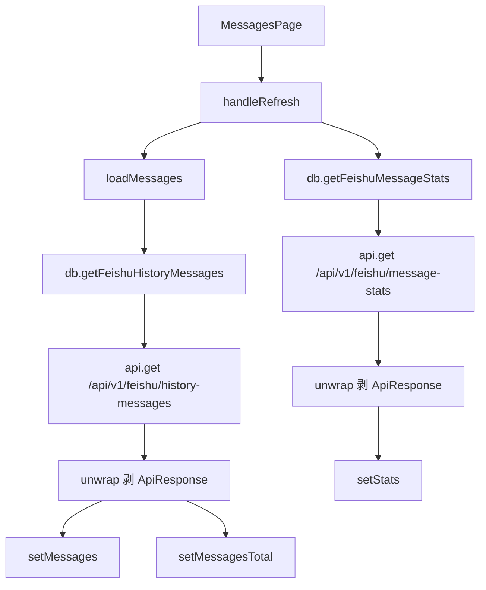
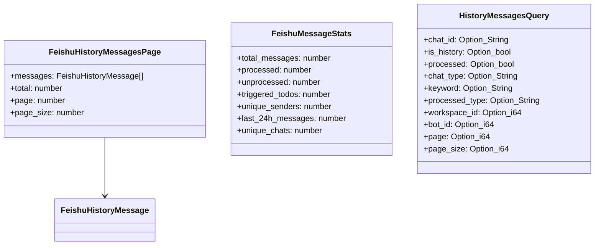
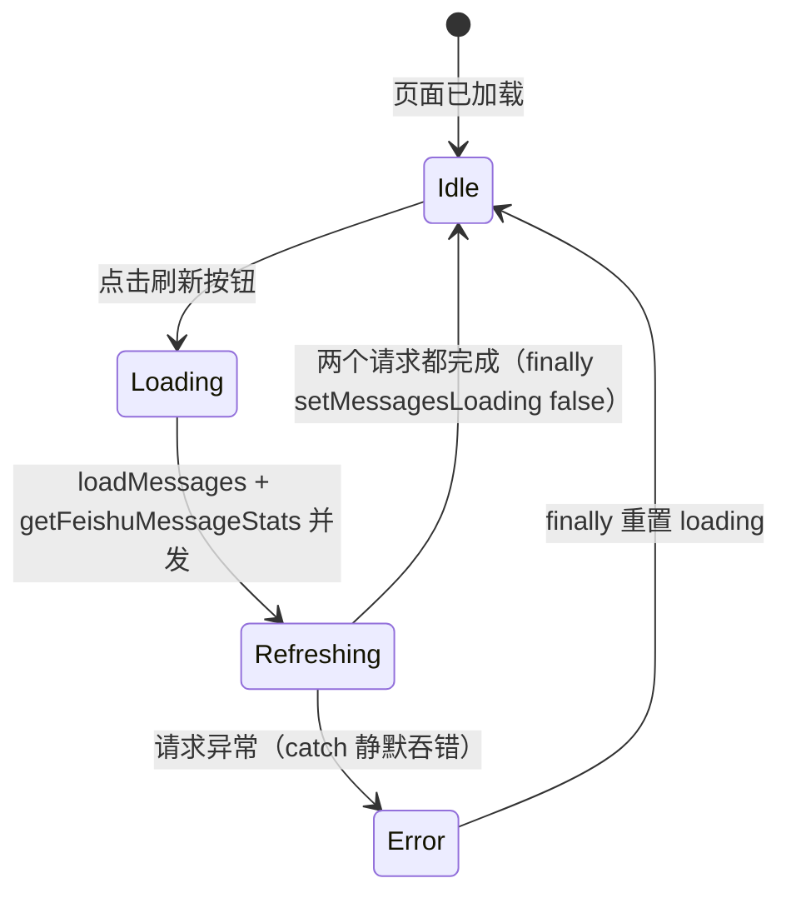

# 刷新消息列表

## 功能位置

消息页 → 顶部 `MessageHeader` 的「刷新」按钮（`ReloadOutlined`）

## 数据流图（前端 → 后端）

## 调用关系链路图

## 数据结构图

## 数据变更图

## 开发指导

- **前端入口**：`frontend/src/components/MessagesPage.tsx` 的 `handleRefresh` 函数
- **后端入口**：`backend/src/handlers/feishu_history.rs` 的 `get_history_messages` 和 `get_message_stats` handler
- **注意**：`loadMessages` 的依赖数组包含所有筛选状态（selectedChatId / isHistory / processedFilter / chatTypeFilter / processedTypeFilter / messagesPage / messagesPageSize / activeBotId / debouncedSearch），任一变化都会自动触发重新拉取；手动刷新只是额外同时重拉统计，不要在 `handleRefresh` 中重复调用 `loadMessages` 已经覆盖的逻辑
- **扩展**：若需要刷新时清空缓存（如 `runDataCache`），在 `handleRefresh` 内追加清空逻辑后调用 `loadMessages`；新增统计维度时在 `FeishuMessageStats` 接口和后端 `MessageStatsParams` / SQL 聚合中同步添加
