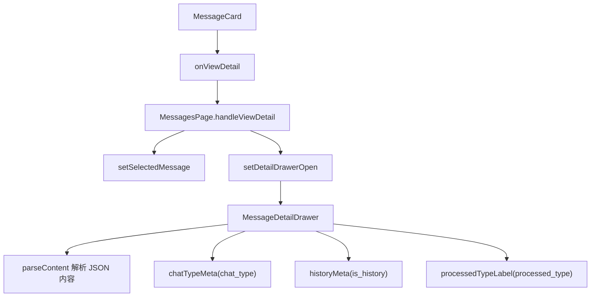
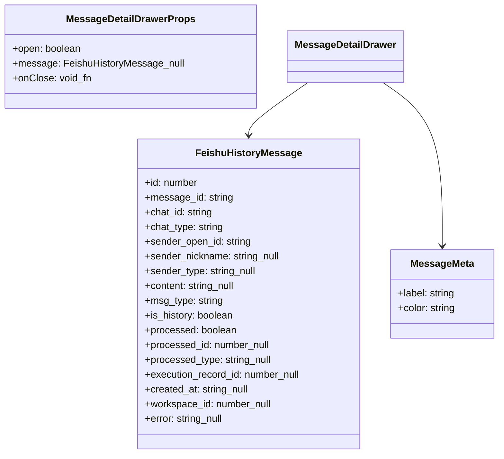
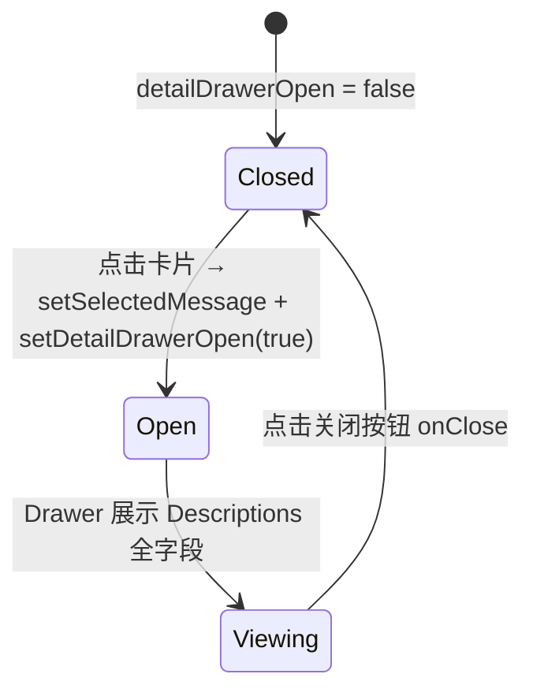

# 查看消息详情

## 功能位置

消息页 → 消息卡片列表中点击任意 `MessageCard`（卡片整体可点击）

## 数据流图（前端 → 后端）

## 调用关系链路图

## 数据结构图

## 数据变更图

## 开发指导

- **前端入口**：`frontend/src/components/message-monitor/MessageDetailDrawer.tsx` 的 `MessageDetailDrawer` 组件；由 `MessagesPage` 的 `handleViewDetail` 触发
- **后端入口**：无额外后端调用——详情抽屉直接展示已从列表请求中获取的 `FeishuHistoryMessage` 对象全字段，无需二次拉取
- **注意**：`MessageCard` 的整卡 `onClick={onViewDetail}` 会触发详情抽屉，但卡片内的「执行记录」按钮和复制按钮都通过 `e.stopPropagation()` 阻止冒泡，避免误触详情；`parseContent` 对 `msg_type='text'` 的消息会尝试 `JSON.parse(content)` 提取 `.text`，解析失败时兜底返回原始 content
- **扩展**：若需在详情中展示关联实体的详情（如跳转到 Todo 或 Loop），在 `Descriptions` 中追加可点击链接，复用 `useViewState` 的 `selectTodo` / `selectWiki` 导航能力
