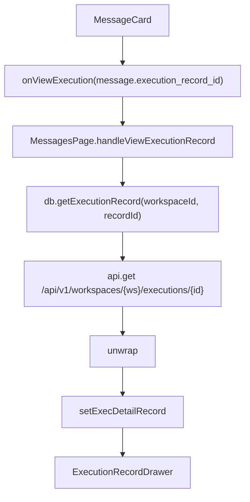
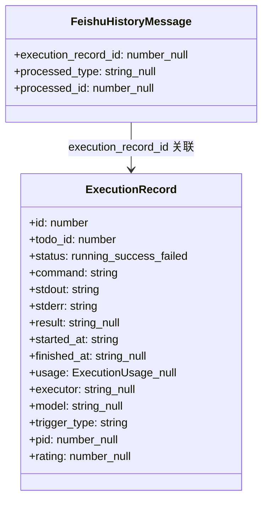
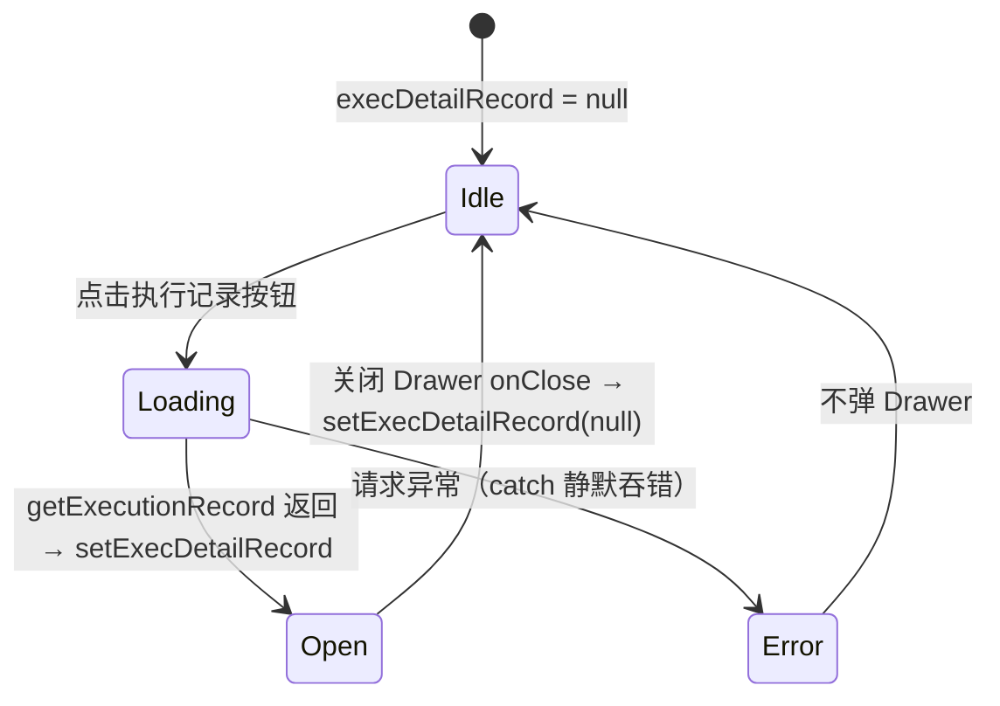

# 查看执行记录

## 功能位置

消息页 → 消息卡片右侧「执行记录」按钮（`EyeOutlined`），仅在 `execution_record_id` 存在且 `processed_type` 非环路类型时触发

## 数据流图（前端 → 后端）

```mermaid
flowchart LR
  U[用户点击执行记录按钮] --> MC["MessageCard onViewExecution"]
  MC --> HER["handleViewExecutionRecord(recordId)"]
  HER --> DB["db.getExecutionRecord(workspaceId, recordId)"]
  DB --> API["GET /api/v1/workspaces/{ws}/executions/{recordId}"]
  API --> H[get_execution_record handler]
  H --> DAO["db 查询 execution_records 表 by id"]
  DAO --> REC[ExecutionRecord]
  REC --> SER["setExecDetailRecord(record)"]
  SER --> ERD[ExecutionRecordDrawer 打开]
```

## 调用关系链路图

## 数据结构图

## 数据变更图

## 开发指导

- **前端入口**：`frontend/src/components/MessagesPage.tsx` 的 `handleViewExecutionRecord` 函数；详情展示在 `ExecutionRecordDrawer` 组件（来自 `settings/messages/`）
- **后端入口**：`backend/src/handlers/execution.rs` 的 `get_execution_record` handler，查询 `execution_records` 表
- **注意**：`MessageCard` 内部用 `isLoopType(message.processed_type)` 判断——`slash_command_loop` 和 `default_response_loop` 类型会走 `onViewLoopExecution` 而非本入口，只有非环路类型才走 `onViewExecution(message.execution_record_id)`；`handleViewExecutionRecord` 的 catch 为空块静默吞错，加载失败时不弹 Drawer 也不 toast
- **扩展**：若需展示执行日志，在 `ExecutionRecordDrawer` 内追加「查看日志」按钮调用 `db.getExecutionLogs(workspaceId, recordId)`，复用 `LogDrawer` 组件
