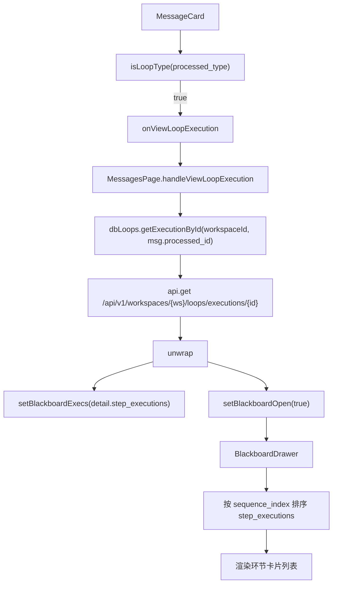
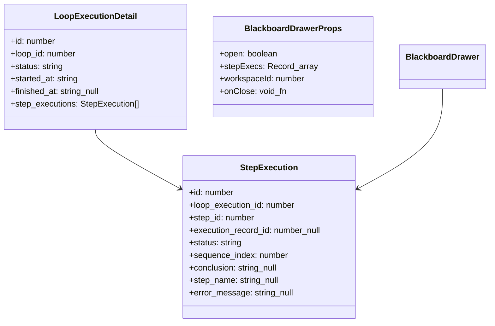
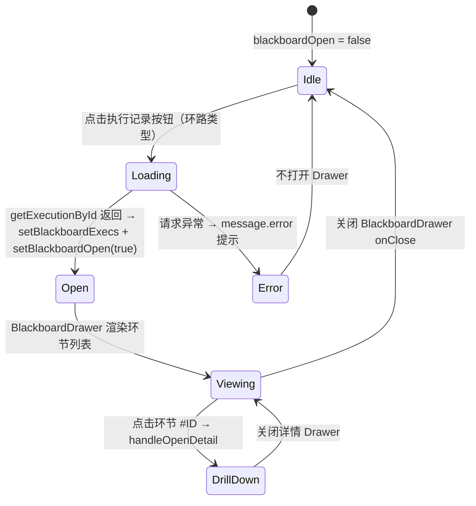

# 查看环路执行详情

## 功能位置

消息页 → 消息卡片右侧「执行记录」按钮（`EyeOutlined`），仅在 `processed_type` 为环路类型（`slash_command_loop` / `default_response_loop`）且 `processed_id` 存在时触发

## 数据流图（前端 → 后端）

```mermaid
flowchart LR
  U[用户点击执行记录按钮] --> MC["MessageCard onViewLoopExecution"]
  MC --> HVL["handleViewLoopExecution(msg)"]
  HVL --> CK["msg.processed_id 存在?"]
  CK -->|不存在| RET[return 不处理]
  CK -->|存在| DB["dbLoops.getExecutionById(workspaceId, msg.processed_id)"]
  DB --> API["GET /api/v1/workspaces/{ws}/loops/executions/{id}"]
  API --> H[后端获取执行详情]
  H --> DAO["db 查询 loop_executions + loop_step_executions"]
  DAO --> DET[LoopExecutionDetail 含 step_executions]
  DET --> SE["setBlackboardExecs(detail.step_executions)"]
  SE --> BO["setBlackboardOpen(true)"]
  BO --> BD[BlackboardDrawer 打开]
```

## 调用关系链路图

## 数据结构图

## 数据变更图

## 开发指导

- **前端入口**：`frontend/src/components/MessagesPage.tsx` 的 `handleViewLoopExecution` 函数；详情展示在 `frontend/src/components/loop-studio/executions/BlackboardDrawer.tsx` 的 `BlackboardDrawer` 组件
- **后端入口**：`backend/src/handlers/loop_.rs` 的环路执行详情 handler，查询 `loop_executions` 表并关联 `loop_step_executions` 表
- **注意**：`MessageCard` 内部的分流逻辑是 `isLoopType(message.processed_type) && message.processed_id` 为真时走环路入口，否则走普通执行记录入口；`handleViewLoopExecution` 中 `processed_id` 对环路类型来说是 `loop_execution_id`，通过 `dbLoops.getExecutionById` 直接按执行 ID 获取（无需 loop_id）；加载失败会 `message.error('加载环路执行详情失败')` 提示用户
- **扩展**：若需在黑板抽屉中展示更多环节信息（如评分、审批状态），在 `StepExecution` 类型中追加字段并在 `BlackboardDrawer` 的环节卡片渲染区补充展示
