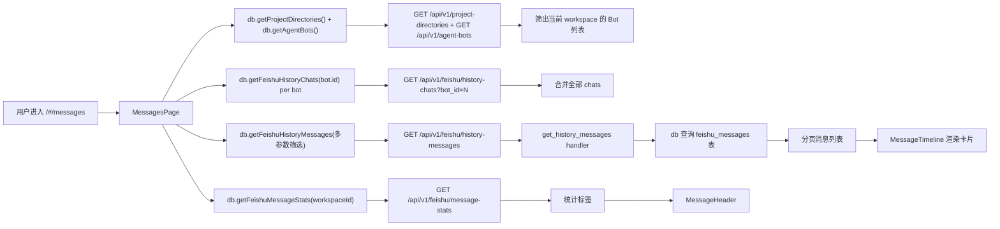

# 消息

> 页面级总览。本页各功能点的 4 图 + 开发指导在子文档中维护。

## 页面简介

消息页（`MessagesPage`）是 `/#/messages` 路由对应的监控台容器，用于实时查看和管理工作空间下飞书 Bot 的历史消息记录。页面顶部 `MessageHeader` 展示工作空间名称、统计标签（今日消息数 / 已处理 / 未处理）与刷新、配置按钮；桌面端左侧 `MessageSidebar` 展示 Bot 列表供筛选，右侧 `MessageTimeline` 渲染消息卡片列表与筛选区；移动端 Bot 筛选回退为按钮组平铺，时间线全宽展示。

数据按 `workspaceId` 隔离：挂载时并行拉取 `db.getProjectDirectories()` 和 `db.getAgentBots()`，筛出当前工作空间的 Bot；随后按 Bot 并发拉取 `db.getFeishuHistoryChats(bot.id)` 合并全部群聊会话。消息列表通过 `db.getFeishuHistoryMessages()` 发送多参数筛选请求（chat_id / is_history / processed / chat_type / keyword / processed_type / workspace_id / bot_id / 分页），后端走 `GET /api/v1/feishu/history-messages` → `get_history_messages` handler → `db` 原生 SQL 查询 `feishu_messages` 表，返回分页结果。搜索关键字采用 300ms 防抖后下沉到后端 LIKE 扫描，避免每次按键打后端。统计走 `db.getFeishuMessageStats(workspaceId)` → `GET /api/v1/feishu/message-stats`。

页面还提供三种下探入口：点击消息卡片打开 `MessageDetailDrawer` 查看原始字段详情；点击「执行记录」按钮根据 `processed_type` 分流——环路类型跳转 `BlackboardDrawer` 查看环节结论，其他类型打开 `ExecutionRecordDrawer` 查看执行记录；点击「配置」按钮打开 `MessageConfigDrawer`，内嵌斜杠命令面板与默认响应规则面板。

## 页面级数据流总图

