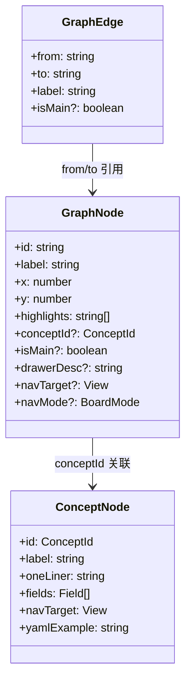
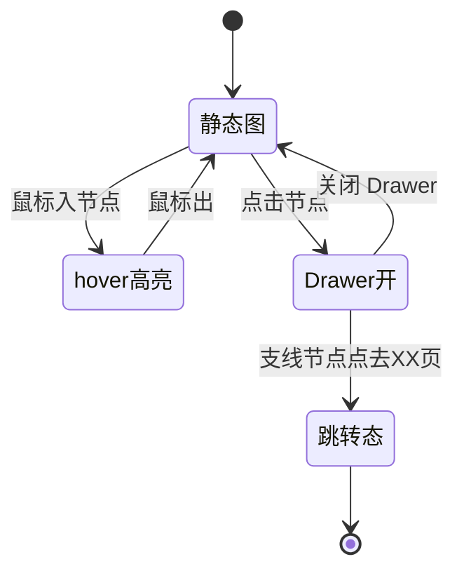

# 概念关系图

导航页 section 1 的概念关系图，用纯 SVG 手绘主链 4 节点 + 支线 6 节点 + hover 高亮 + 点击弹 Drawer。

## 在这里做什么

- 一眼看清 NTD 6 个核心概念之间的关系
- hover 任一节点，关联节点高亮
- 点节点弹 Drawer 看概念详解（字段定义表）
- 支线节点 Drawer 带跳转按钮，可直达对应操作页

## 怎么操作

1. 鼠标移入任一节点，该节点及关联节点高亮。
2. 鼠标移出，高亮消失，回到静态图。
3. 点主链节点（process/loop/todo/execution），弹 Drawer 看概念详解。
4. 点支线节点（task/executor/expert/skill/model/blackboard/kanban），弹 Drawer 看定制 `drawerDesc` + 跳转按钮。

## 操作后会发生什么

- 关系图不引 reactflow 重依赖，节点固定 10 个手布局。
- 尊重 `prefers-reduced-motion`，动画降级为静态高亮。
- 跳转走 `pushUrl(navTarget, navMode)`，触发 ntd-nav-change 事件全站同步。

## 数据结构

## 节点交互状态

## 常见问题

**Q：为什么不用 reactflow？**
A：节点固定 10 个手布局即可，reactflow 重依赖 YAGNI。

**Q：新增支线节点怎么扩展？**
A：在 `GRAPH_NODES` 加项（x/y/highlights/conceptId 或 drawerDesc/navTarget）、`GRAPH_EDGES` 加连线；新增有独立页的支线节点用 `navTarget` + `navMode` 三字段向后兼容。
