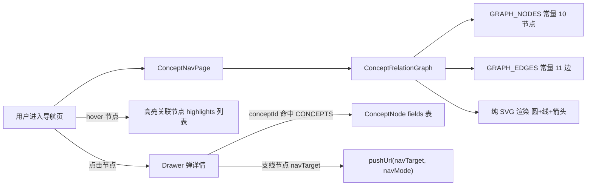
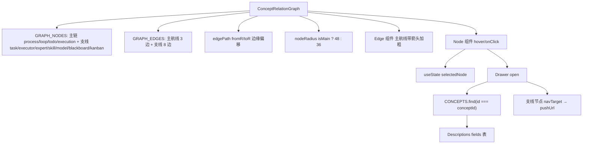
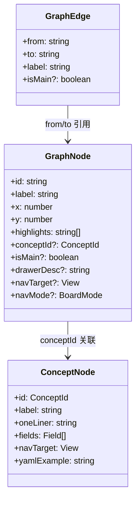
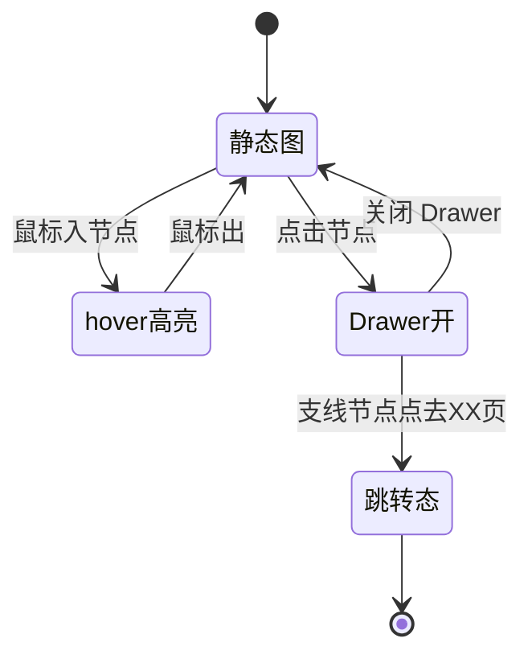

# 概念关系图

## 功能位置

导航（概念首页） → section「概念关系图」 → `ConceptRelationGraph` SVG 图（主链 4 节点 + 支线 6 节点 + hover 高亮 + 点击弹 Drawer）

## 数据流图（前端 → 后端）

## 调用关系链路图

## 数据结构图

## 数据变更图

## 开发指导

- **前端入口**：`frontend/src/components/onboarding/ConceptRelationGraph.tsx` 的 `ConceptRelationGraph` 组件；节点/边数据在 `frontend/src/components/onboarding/concepts.tsx` 的 `GRAPH_NODES` / `GRAPH_EDGES` 常量
- **后端入口**：纯展示组件，不直接调后端；概念数量徽标由 `ConceptCardGrid` 调 `useConceptCounts` 拉取
- **注意**：不引 reactflow 重依赖（节点固定 10 个手布局）；尊重 `prefers-reduced-motion` 动画降级为静态高亮；支线节点 Drawer 支定制 `drawerDesc` + 跳转按钮（黑板/看板）；跳转必须走 `pushUrl` 不能用 `location.hash` 蜂跳（否则不触发 ntd-nav-change 事件全站同步）
- **扩展**：增支线节点时，在 `GRAPH_NODES` 加项（x/y/highlights/conceptId 或 drawerDesc/navTarget）、`GRAPH_EDGES` 加连线；新增有独立页的支线节点用 `navTarget` + `navMode` 三字段向后兼容
