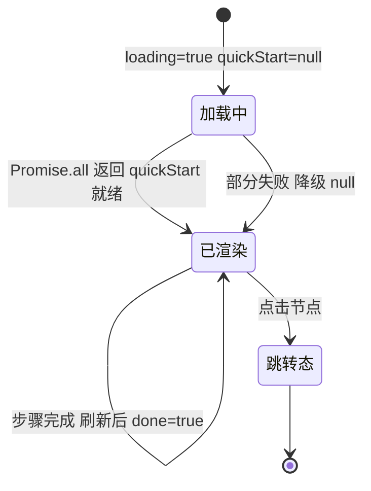

# 快速开始 5 步

导航页 section「快速开始」的横向流程图，4 步：安装工艺 / 创建任务 / 监控执行 / 验收产物。

注：044 触发器整体下线后，快速开始已从 5 步收敛为 4 步，文件名保留「5 步」为历史命名。

## 在这里做什么

- 跟着 4 步跑通第一条流水线
- 每步带完成状态判断（done / step / onGoto）
- 点节点跳转对应操作页

## 怎么操作

1. 看横向流程图，4 个 StepNode 按序排列。
2. 每步状态图标：done=true 绿 ✓，false / null 灰 ○。
3. 点任一节点，`handleGoto(navTarget)` 跳转对应操作页。

## 操作后会发生什么

- `useConceptCounts(workspaceId)` 并行拉 6 个 API（processes / loops / todos / tasks / executors / experts），`Promise.all` 每个 catch 为 null 永不 reject。
- `quickStart` 完成状态由 4 步对应 API 返回值判断：
  - 步骤 1（安装工艺）：processes 非空
  - 步骤 2（创建任务）：tasks 非空
  - 步骤 3（监控执行）：getExecutionRecords 非空
  - 步骤 4（验收产物）：暂用步骤 3 同源判断（完整实现需扫审计 API，YAGNI 阶段先简化）
- `done=null` 表示拉取失败 / 未拉取，渲染灰色问号兜底。
- 跳转走 `pushUrl(step.navTarget, {})`。

## 步骤完成状态流转

## 常见问题

**Q：为什么步骤 4 用步骤 3 同源判断？**
A：完整实现需扫审计 API，YAGNI 阶段先简化，后续按需补齐。

**Q：横向流程图节点宽度为什么固定 120px？**
A：避免间距不均，保证 4 步在窄屏也能横向排开。
