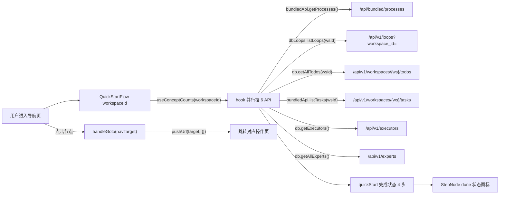
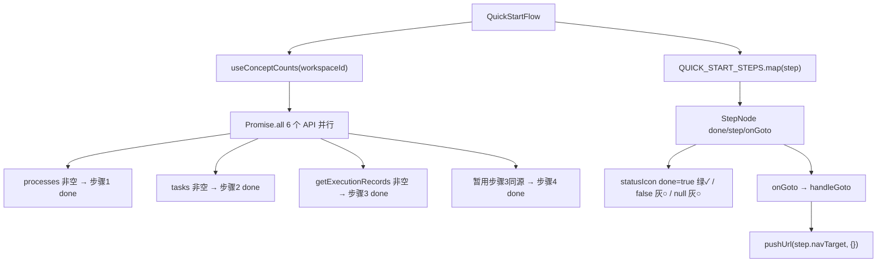
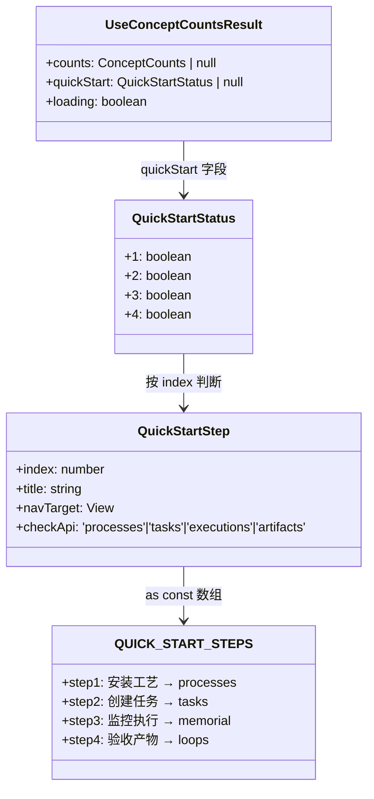
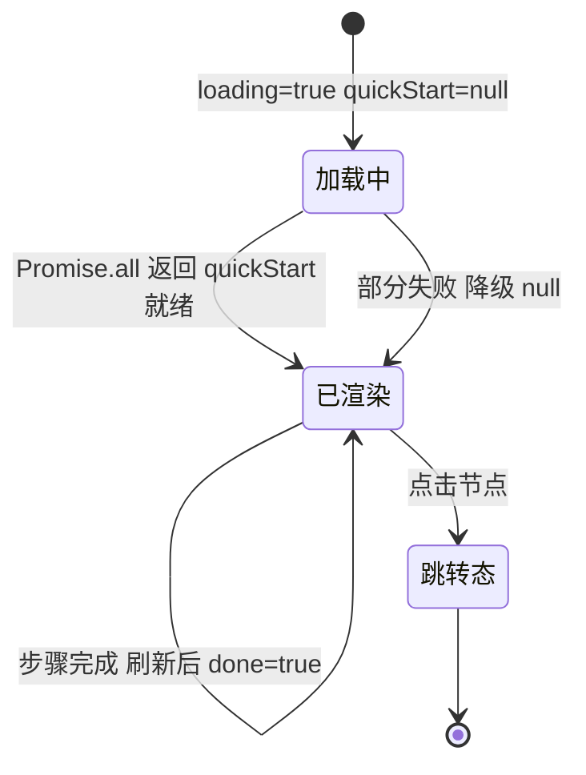

# 快速开始 5 步

## 功能位置

导航（概念首页） → section「快速开始」 → `QuickStartFlow` 横向流程图（4 步：安装工艺 / 创建任务 / 监控执行 / 验收产物）

注：044 触发器整体下线后，快速开始已从 5 步收敛为 4 步，文件名保留「5 步」为历史命名。

## 数据流图（前端 → 后端）

## 调用关系链路图

## 数据结构图

## 数据变更图

## 开发指导

- **前端入口**：`frontend/src/components/onboarding/QuickStartFlow.tsx` 的 `QuickStartFlow` 组件；步骤定义在 `frontend/src/components/onboarding/concepts.tsx` 的 `QUICK_START_STEPS` 常量；完成状态在 `frontend/src/hooks/useConceptCounts.ts` 的 `useConceptCounts` hook
- **后端入口**：完成判断拉 6 个 REST API（processes/loops/todos/tasks/executors/experts），并行 `Promise.all` 每个 catch 为 null 永不 reject
- **注意**：步骤 4（验收产物）暂用步骤 3 同源判断（完整实现需扫审计 API，YAGNI 阶段先简化）；`done=null` 表示拉取失败/未拉取，渲染灰色问号兜底；横向流程图节点固定宽度 120px 避免间距不均；跳转走 `pushUrl` 触发 ntd-nav-change 事件全站同步
- **扩展**：恢复/新增步骤时，改 `QUICK_START_STEPS` 数组 + `QuickStartStep` 的 `checkApi` 联合类型；`useConceptCounts` 增对应完成判断 API 调用
