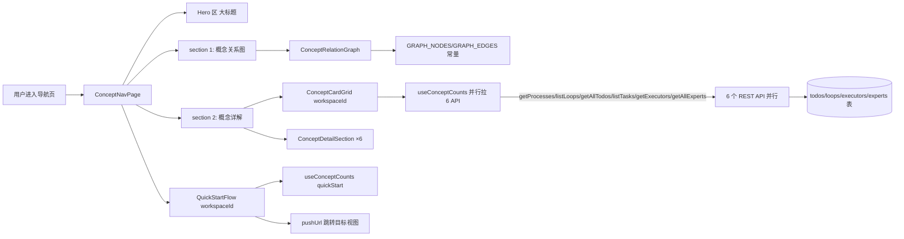

# 导航（概念首页）

> 页面级总览。本页各功能点的 4 图 + 开发指导在子文档中维护。

## 页面简介

导航页（概念首页）是新用户理解 NTD 的落地入口。它把「工艺 → 环路 → 事项 → 任务 → 执行器 → 专家」6 个核心概念用 Hero 区一句话定位 + 概念关系图（纯 SVG 手绘主链/支线节点 + hover 高亮 + 点击弹 Drawer）+ 概念详解（6 张差异化卡片网格 + 6 个详细说明段含字段定义表）+ 快速开始 4 步流程图（完成状态判断 + 跳转入口）串成一体。

关系图不引 reactflow 重依赖，节点固定 7 个主链+支线手布局即可。概念数量徽标与快速开始完成状态由 `useConceptCounts` hook 并行拉 6 个 API（processes/loops/todos/tasks/executors/experts）聚合。

## 页面级数据流总图

## 功能点索引

- [概念关系图](onboarding-concept-graph)
- [快速开始 5 步](onboarding-quick-start)
