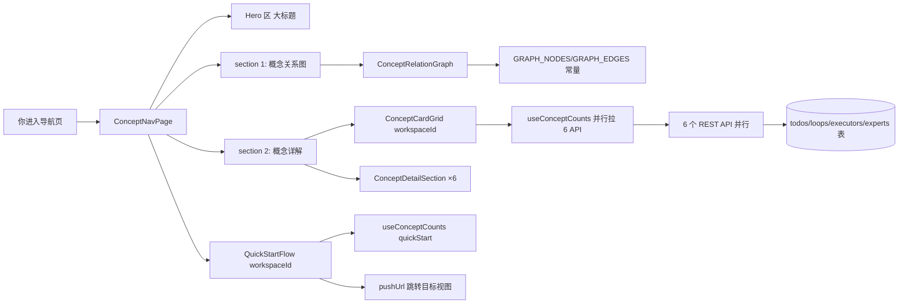

# 导航（概念首页）

导航页是新用户理解 NTD 的落地入口。它把「工艺 → 环路 → 事项 → 任务 → 执行器 → 专家」6 个核心概念用 Hero 区一句话定位 + 概念关系图 + 概念详解 + 快速开始 4 步串成一体。

## 在这里做什么

- 理解 NTD 的 6 个核心概念及它们之间的关系
- 看概念数量徽标（已有多少工艺、环路、事项等）
- 跟着快速开始 4 步跑通第一条流水线
- 点概念关系图节点弹详情，或跳转对应操作页

## 怎么操作

1. 进入导航页，先看 Hero 区大标题。
2. 滚到 section 1「概念关系图」，hover 节点高亮关联节点，点节点弹 Drawer 看详情。
3. 滚到 section 2「概念详解」，6 张差异化卡片网格 + 6 个详细说明段（含字段定义表）。
4. 滚到 section 3「快速开始」，4 步流程图带完成状态判断 + 跳转入口。

## 操作后会发生什么

- 关系图不引 reactflow 重依赖，节点固定 7 个主链 + 支线手布局即可。
- 概念数量徽标与快速开始完成状态由 `useConceptCounts` hook 并行拉 6 个 API 聚合。
- 支线节点 Drawer 支定制 `drawerDesc` + 跳转按钮（黑板 / 看板）。
- 跳转必须走 `pushUrl`，不能用 `location.hash` 蜂跳（否则不触发 ntd-nav-change 事件全站同步）。

## 概念关系图数据流

## 功能点索引

- [概念关系图](onboarding-concept-graph)
- [快速开始 5 步](onboarding-quick-start)
