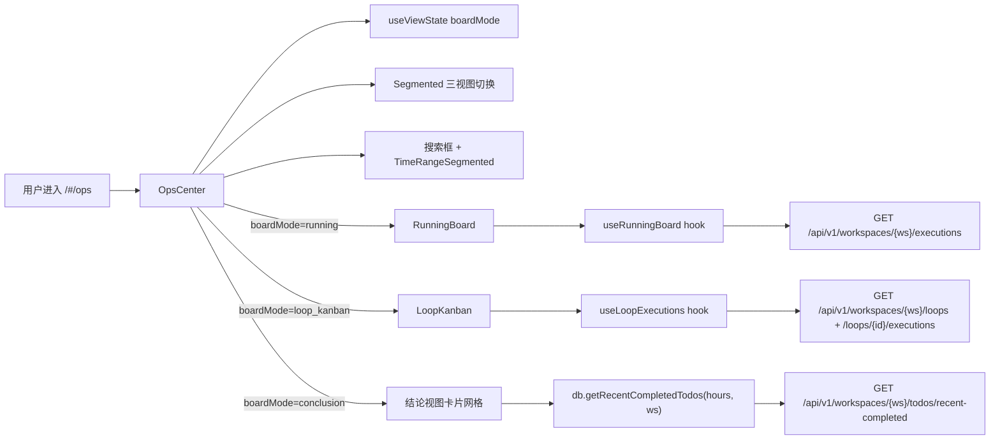

# 运行中心

> 页面级总览。本页各功能点的 4 图 + 开发指导在子文档中维护。

## 页面简介

运行中心页（`OpsCenter`）是 `/#/ops` 路由对应的观察容器，顶部 `PageCard` 的 `extra` 渲染 `Segmented` 三视图切换器（运行视图 / 环路视图 / 结论视图），主体根据 `boardMode` 分别渲染 `RunningBoard`（实时运行状态监控）、`LoopKanban`（环路执行历史看板）或结论视图卡片网格。

> todo 维度的状态看板（待办/进行中/已完成/失败 + 拖拽改状态）已归位到「事项」菜单（`/#/todos` 的看板视图），运行中心不再保留该视图。

`boardMode` 由 `useViewState` 管理，通过 URL `?mode=` query 同步，支持浏览器前进后退，默认进入运行视图。三种视图共享 `hours`（时间窗）和 `searchText`（搜索关键字）状态——用户切换视图时保持筛选条件避免重复输入。工具栏含搜索框（`Input` + `SearchOutlined`）和 `TimeRangeSegmented`（6h / 24h / 72h / all 分段），项目过滤已移除（工作空间切换由 `WorkspaceSwitcher` 统一管理）。

数据按 `state.selectedWorkspace` 隔离：结论视图调用 `db.getRecentCompletedTodos(hours, workspaceId)` → `GET /api/v1/workspaces/{ws}/todos/recent-completed`；运行视图通过 `useRunningBoard` hook 调用 `GET /api/v1/workspaces/{ws}/executions` + `GET /api/v1/workspaces/{ws}/todos/scheduled`；环路视图通过 `useLoopExecutions` hook 调用 `dbLoops.listLoops` + `dbLoops.listExecutions`。

## 页面级数据流总图

