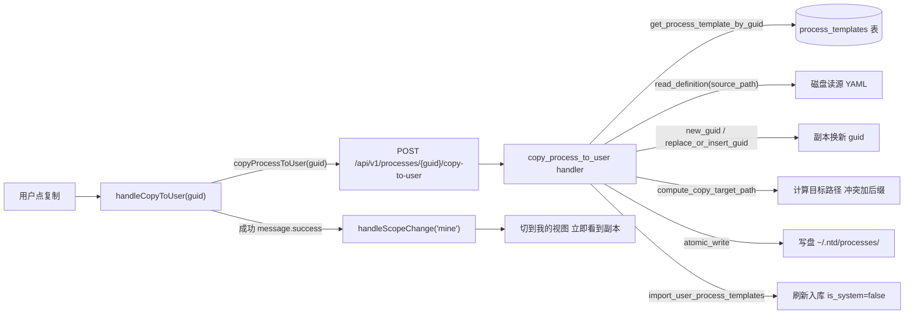
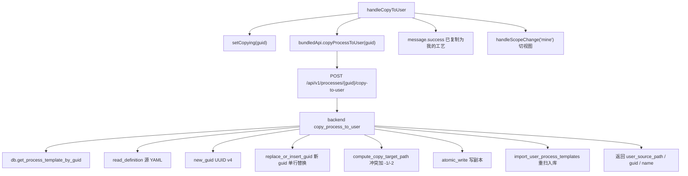
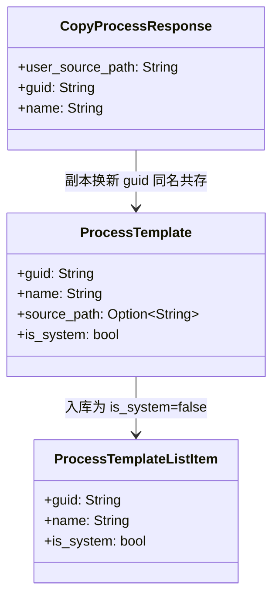
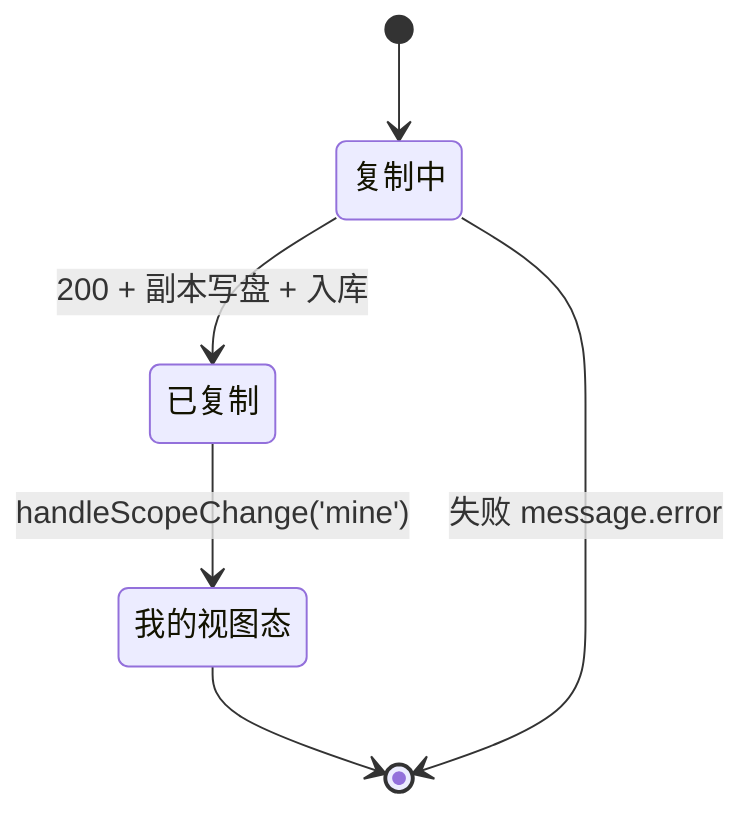

# 复制为我的工艺

## 功能位置

工艺 → 模板视图卡片 actions「复制」按钮 或 详情 YAML Tab（系统工艺）警示条旁「复制为我的工艺后编辑」按钮

## 数据流图（前端 → 后端）

## 调用关系链路图

## 数据结构图

## 数据变更图

## 开发指导

- **前端入口**：`frontend/src/components/ProcessPage.tsx` 的 `handleCopyToUser`；编辑器内也有同逻辑在 `frontend/src/components/process/ProcessEditor.tsx` 的 `handleCopyToUser`（副本跳副本编辑器）
- **后端入口**：`backend/src/handlers/process.rs` 的 `copy_process_to_user` handler；guid 生成在 `backend/src/services/process/guid.rs` 的 `new_guid` / `replace_or_insert_guid`
- **注意**：副本与源同名共存（guid 不同），原模板不消失；文件名冲突时自动加 `-1`/`-2` 后缀；复制成功后自动切「我的」视图，让用户立即看到新卡片并可点编辑
- **扩展**：副本需附源标记时，改 `replace_or_insert_guid` 在 YAML 注 `derived_from` 字元，`import_user_process_templates` 入库时读该元写 `derived_from_guid` 列
