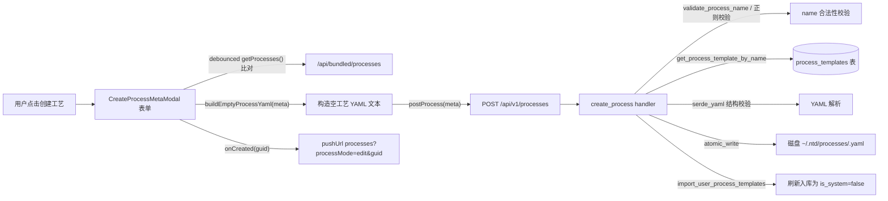
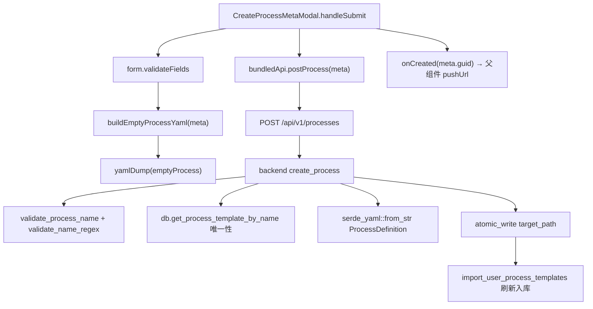
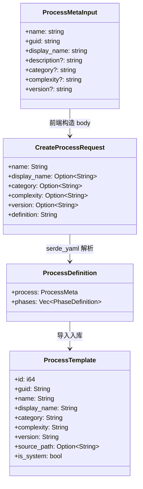
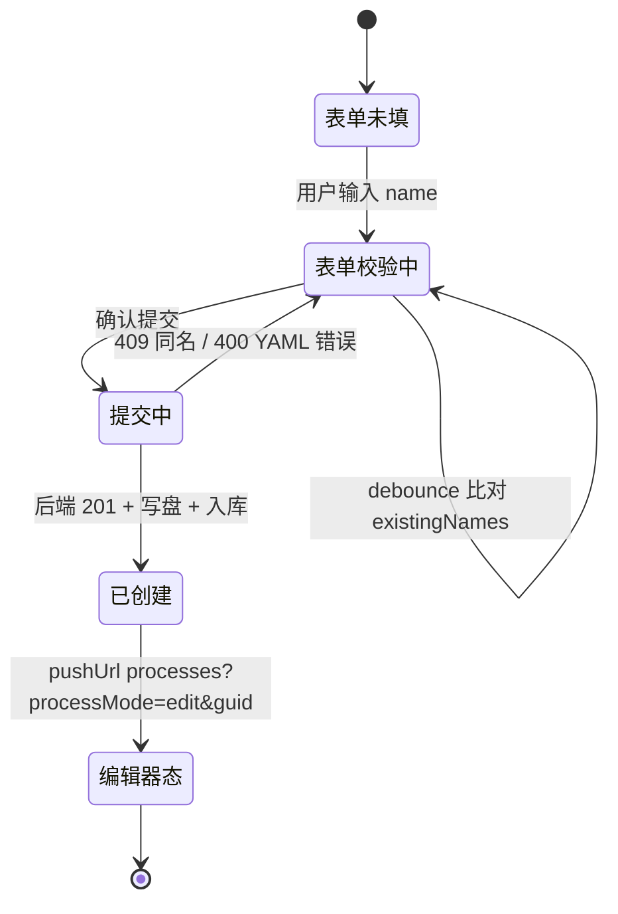

# 创建工艺

## 功能位置

工艺 → 右上角「创建工艺」按钮 → 弹出 `CreateProcessMetaModal` 元信息表单 → 填写 6 字段确认 → 跳编辑器路由

## 数据流图（前端 → 后端）

## 调用关系链路图

## 数据结构图

## 数据变更图

## 开发指导

- **前端入口**：`frontend/src/components/process/CreateProcessMetaModal.tsx` 的 `CreateProcessMetaModal` 组件；`buildEmptyProcessYaml` 在 `frontend/src/components/process/buildEmptyProcessYaml.ts`
- **后端入口**：`backend/src/handlers/process.rs` 的 `create_process` handler，路由 `POST /api/v1/processes`
- **注意**：`name` 只能含 `[a-zA-Z0-9_-]`，前端 debounce 校验只做唯一性兜底，最终防线在后端 409；guid 由前端 `crypto.randomUUID()` 生成并写入 YAML，后端不再二次生成
- **扩展**：新增元信息字段时，在 `ProcessMetaInput` 加字段、`buildEmptyProcessYaml` 决是否写入、`CreateProcessRequest` 加对应 Option 字段、`buildEmptyProcessYaml` 的 processObj 决输出键
