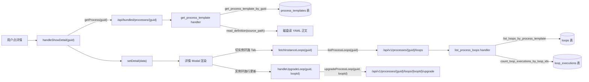
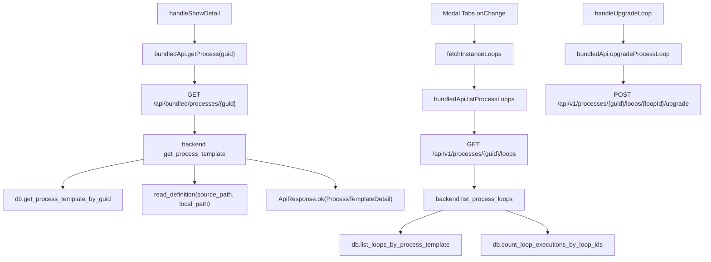
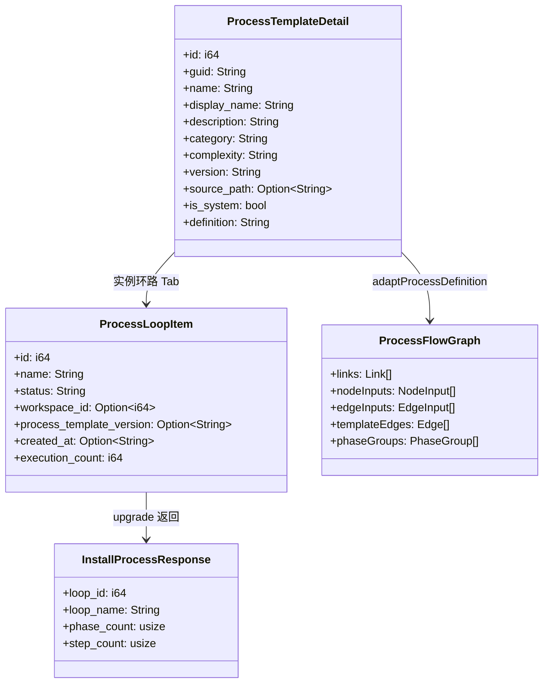
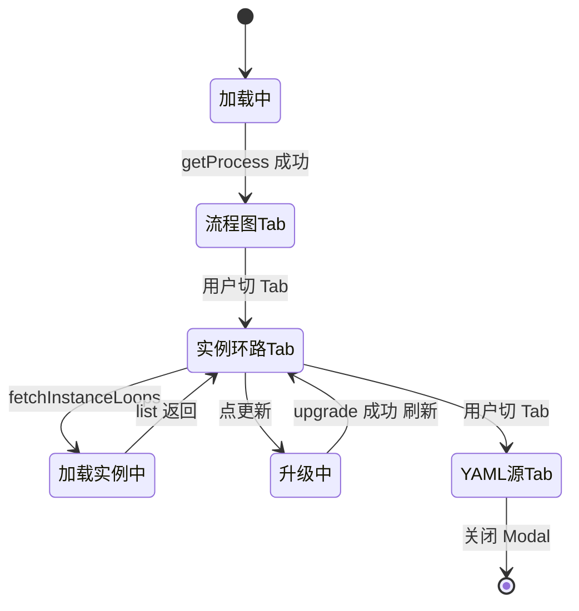

# 查看工艺详情

## 功能位置

工艺 → 工艺卡片 actions「详情」按钮 或 URL 携 guid 参数自动打开 → 弹出详情 Modal（流程图 / 实例环路 / YAML 源 三 Tab）

## 数据流图（前端 → 后端）

## 调用关系链路图

## 数据结构图

## 数据变更图

## 开发指导

- **前端入口**：`frontend/src/components/ProcessPage.tsx` 的 `handleShowDetail` / `fetchInstanceLoops` / `handleUpgradeLoop`；流程图组件 `frontend/src/components/process/ProcessFlowGraph.tsx`，适配器 `adaptProcessDefinition`
- **后端入口**：`backend/src/handlers/process.rs` 的 `get_process_template` / `list_process_loops` / `upgrade_process_loop` handler；升级 service 在 `backend/src/services/process/installer.rs` 的 `upgrade_process_template_loop`
- **注意**：工艺正文不在 DB，按 `source_path` 从磁盘实时读取；`upgrade_process_template_loop` 是不可逆操作——旧步骤 todo 软删但历史执行数据保留；URL 携 guid 时 useEffect 自动打开详情并用 cancelled flag 防竞态
- **扩展**：详情 Modal 增新 Tab 时，在 `Tabs.items` 加项、在 `onChange` 按需触发懒加载 API
