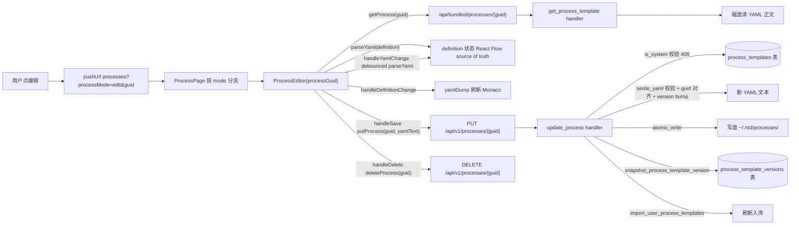
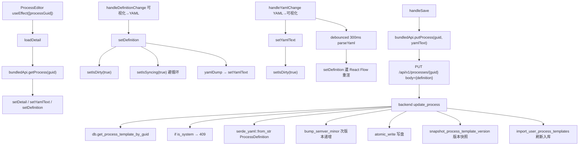
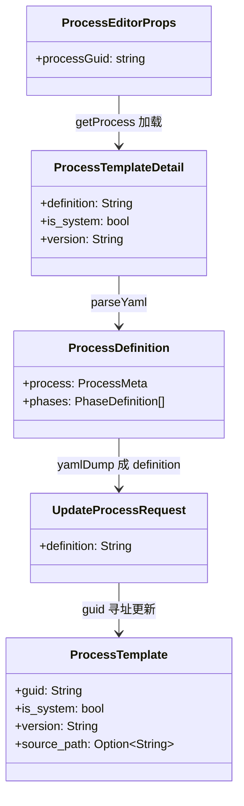
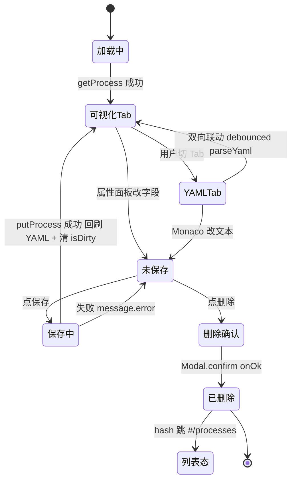

# 编辑工艺

## 功能位置

工艺 → 用户工艺卡片 actions「编辑」按钮 或 详情 YAML Tab「编辑工艺」按钮 → 跳路由 `processes?processMode=edit&guid=<guid>` → `ProcessEditor` 三栏布局（工具栏 + 可视化/YAML 双 Tab + 属性面板）

## 数据流图（前端 → 后端）

## 调用关系链路图

## 数据结构图

## 数据变更图

## 开发指导

- **前端入口**：`frontend/src/components/process/ProcessEditor.tsx` 的 `ProcessEditor` 组件；`handleDefinitionChange` / `handleYamlChange` / `handleSave` / `handleDelete`；`parseYaml` / `yamlDump` 在 `frontend/src/components/process/processYamlValidator.ts`
- **后端入口**：`backend/src/handlers/process.rs` 的 `update_process` / `delete_process` handler，路由 `PUT /api/v1/processes/{guid}` / `DELETE /api/v1/processes/{guid}`
- **注意**：系统工艺（`is_system=true`）后端返回 409，前端编辑器内给「复制为我的工艺」按钮而非直接编辑；保存后回刷 Monaco 为后端递增后的真值 YAML（含新 version），防陈旧 version 下次保存误判；`isSyncing` flag 防 Monaco/React Flow 双向循环
- **扩展**：新增工艺字段时，扩 `ProcessDefinition` / `ProcessMeta`、属性面板加对应表单、`yamlDump` 序列化键、后端 `ProcessDefinition` serde struct + installer 读取
