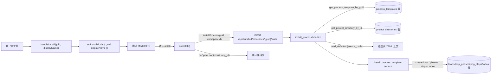
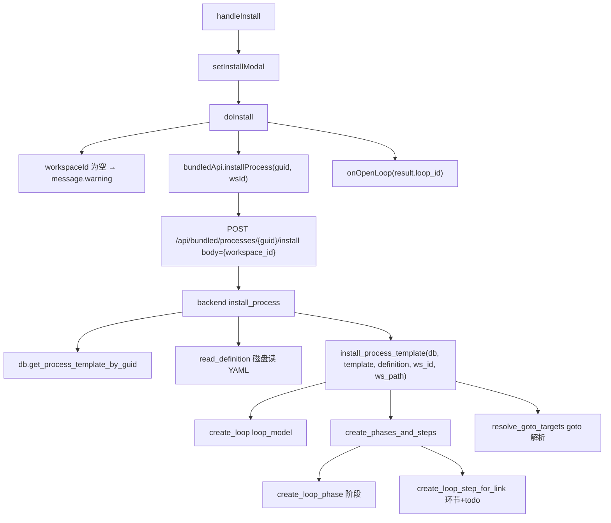
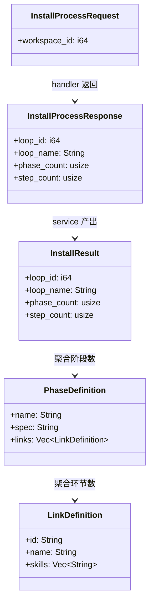
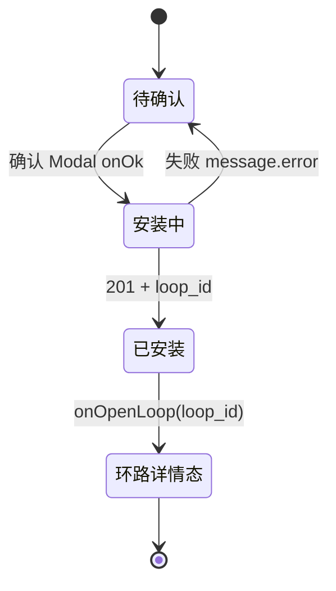

# 安装到工作空间

## 功能位置

工艺 → 工艺卡片 actions「安装」按钮 或 详情 Modal 底部「安装到当前工作空间」按钮 → 弹确认 Modal → 确认 → 跳环路详情

## 数据流图（前端 → 后端）

## 调用关系链路图

## 数据结构图

## 数据变更图

## 开发指导

- **前端入口**：`frontend/src/components/ProcessPage.tsx` 的 `handleInstall` 与 `doInstall`；`bundledApi.installProcess` 在 `frontend/src/api/bundled.ts`
- **后端入口**：`backend/src/handlers/process.rs` 的 `install_process` handler；service 在 `backend/src/services/process/installer.rs` 的 `install_process_template`
- **注意**：`workspaceId` 为空时前端弹 warning 不发请求；安装即实例化——创建 loop/loop_phases/loop_steps/todos 一整链；goto 目标在二遍解析（先建 step 收集 id 映射，再 resolve_goto_targets）
- **扩展**：新增环节级字段时，改 `LinkDefinition`、`create_loop_step_for_link` 写入 loop_steps 列、`create_todo_for_link` 同步事项列
