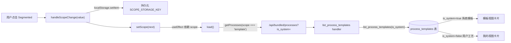
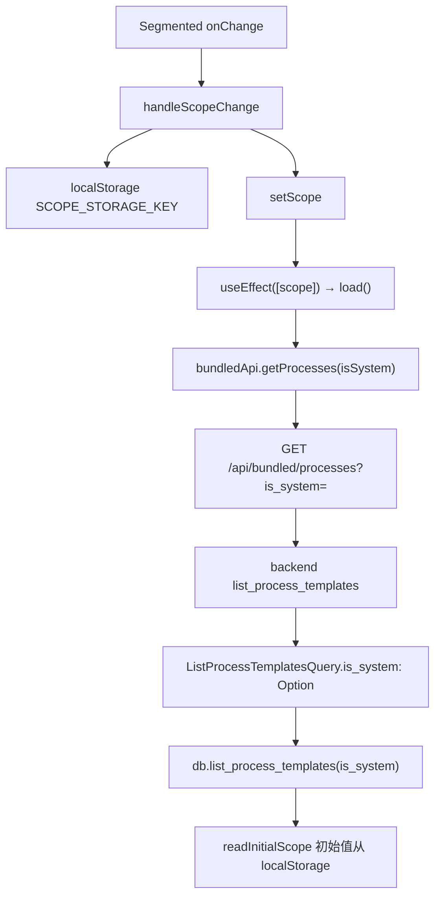
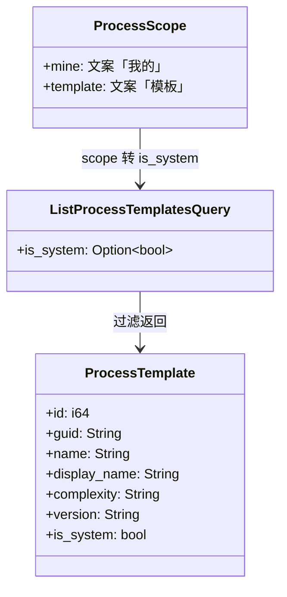
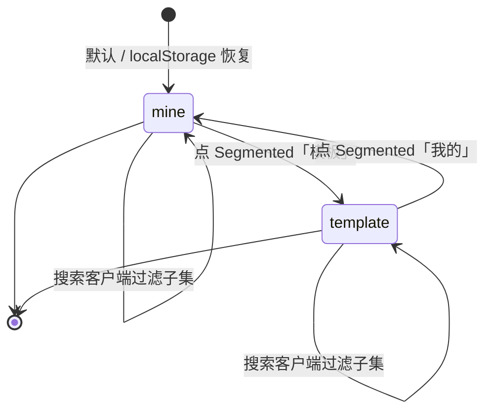

# 我的/模板视图切换

## 功能位置

工艺 → 搜索栏上方的 `Segmented` 控件（「我的」「模板」两段）

## 数据流图（前端 → 后端）

## 调用关系链路图

## 数据结构图

## 数据变更图

## 开发指导

- **前端入口**：`frontend/src/components/ProcessPage.tsx` 的 `ProcessListView` 内 `handleScopeChange` + `readInitialScope`；`SCOPE_STORAGE_KEY` 常量定义在同文件
- **后端入口**：`backend/src/handlers/process.rs` 的 `list_process_templates` handler，路由 `GET /api/bundled/processes`
- **注意**：服务端按 `is_system` 过滤，不做全量拉取+客户端 filter；切换视图不清空 `searchText`，避免用户输入丢失；空态按视图给出不同引导（「我的」空引导创建，「模板」空引导同步）
- **扩展**：新增视图段（如「团队」）时，扩 `ProcessScope` 联合类型、Segmented options、`readInitialScope` 兼容解析、后端 `ListProcessTemplatesQuery` 增查询字段
