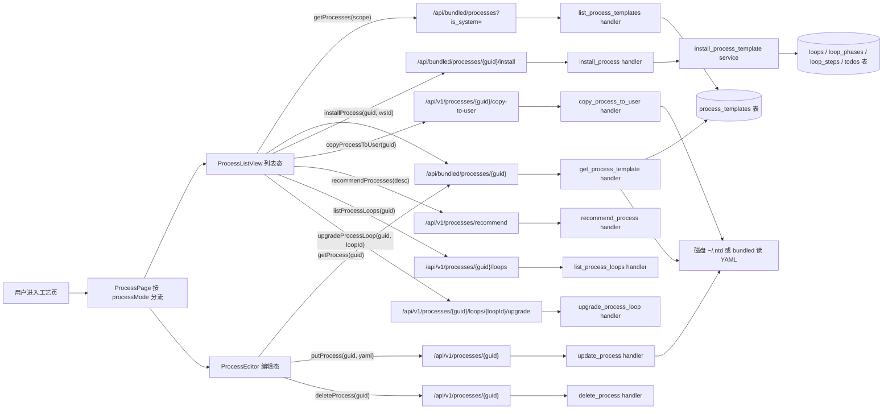

# 工艺

> 页面级总览。本页各功能点的 4 图 + 开发指导在子文档中维护。

## 页面简介

工艺页是「工艺模板库」的浏览与管理入口。它把系统工艺（bundled 同步过来的内置模板）与用户工艺（`~/.ntd/processes/` 下自定义 YAML）统一成卡片网格，提供「我的/模板」视图切换、按描述推荐工艺、查看流程图详情、安装为环路、复制为我的工艺、进入可视化/YAML 编辑器等能力。

页面顶层由 `ProcessPage` 按 `processMode` 分流：列表态走 `ProcessListView`，编辑态走 `ProcessEditor`，新建态走 `ProcessEditorPlaceholder`。工艺正文不在数据库，按 `source_path` 从磁盘文件实时读取（DB 仅存元信息），保证磁盘是唯一真源。

## 页面级数据流总图

## 功能点索引

- [创建工艺](process-create)
- [我的/模板视图切换](process-scope-switch)
- [安装到工作空间](process-install)
- [查看工艺详情](process-detail)
- [编辑工艺（进编辑器）](process-edit)
- [复制为我的工艺](process-copy)
