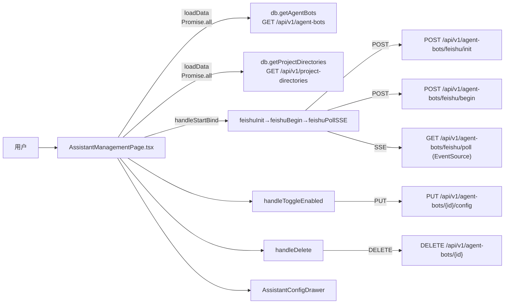

# 智能助手页

> 总览

## 页面简介

智能助手页（AssistantManagementPage）是前端导航中的独立菜单项，统一管理所有已绑定的智能助手（目前支持飞书智能体）。页面提供刷新、绑定新智能助手两个入口，并以表格（桌面）或卡片（移动端）形式展示智能助手列表。每个智能助手可配置推送规则、群聊白名单、接收策略，以及切换服务工作空间、启用/停用、删除。

## 页面级数据流总图

