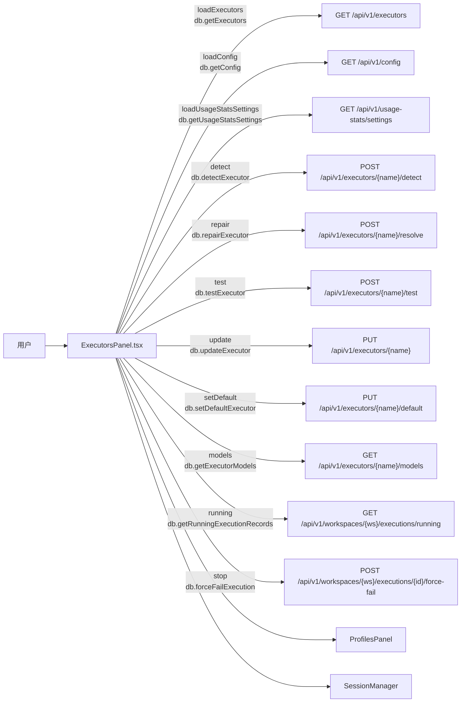

# 执行器页

> 总览

## 页面简介

执行器页（Executors）管理本地 AI 执行器的路径、开关、默认模型、会话目录等配置，并提供二进制检测、修复、测试、批量检测等运维能力。页面通过 `Tabs` 切换三个子页签：执行器（配置表 + 运行配置 + AI 使用统计）、API Key（ProfilesPanel）、正在运行（运行中任务表 + 批量停止）、会话（SessionManager）。关闭开关的执行器不会出现在 Todo 的执行器选择列表中。

## 页面级数据流总图

## 功能点索引

- [executors-tabs](#/help/settings-executors/executors-tabs) — 执行器 / API Key / 正在运行 / 会话 子页签切换
- [executors-batch-detect](#/help/settings-executors/executors-batch-detect) — 批量检测所有执行器二进制可用性
- [executors-row-actions](#/help/settings-executors/executors-row-actions) — 行操作（设为默认 / 检测 / 修复 / 安装 / 测试）
- [executors-toggle-enabled](#/help/settings-executors/executors-toggle-enabled) — 启用/停用执行器开关
- [executors-running-stop](#/help/settings-executors/executors-running-stop) — 正在运行 Tab 批量/单个停止任务
- [executors-usage-stats](#/help/settings-executors/executors-usage-stats) — AI 使用统计开关与 cron 配置
