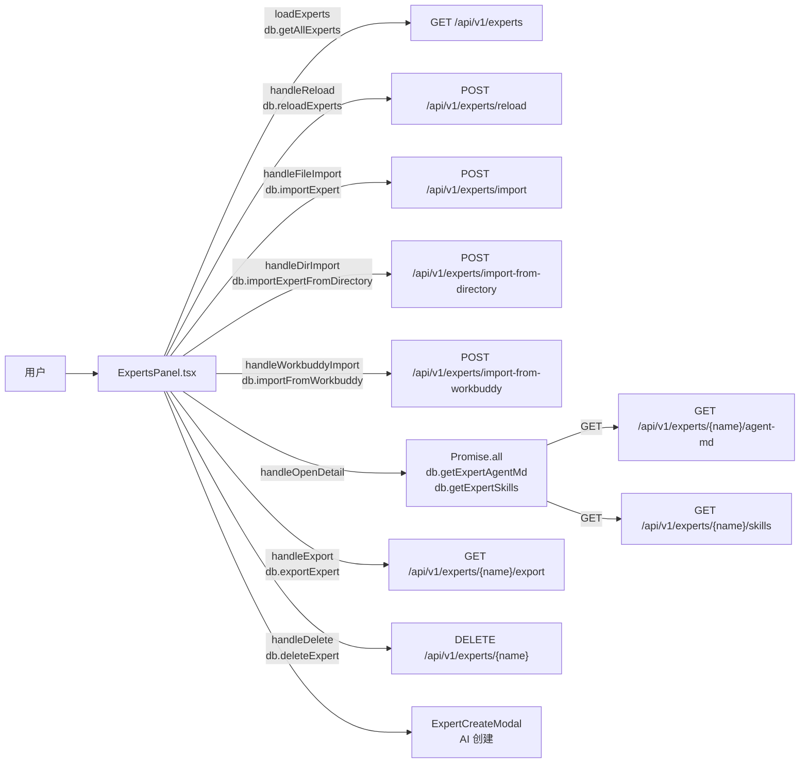

# 专家页

> 总览

## 页面简介

专家页（Experts）管理本地 `~/.ntd/experts/` 目录下的专家定义，支持单个专家（agent）与专家团队（team）两种类型。页面提供搜索、导入（zip 包 / WorkBuddy 目录 / 本地目录）、重新扫描、AI 创建专家等入口，并通过 `Tabs` 将专家与团队分区展示。点击专家卡打开详情 Modal，可查看 agent.md、关联技能、标签、团队成员并执行导出/删除。

## 页面级数据流总图

