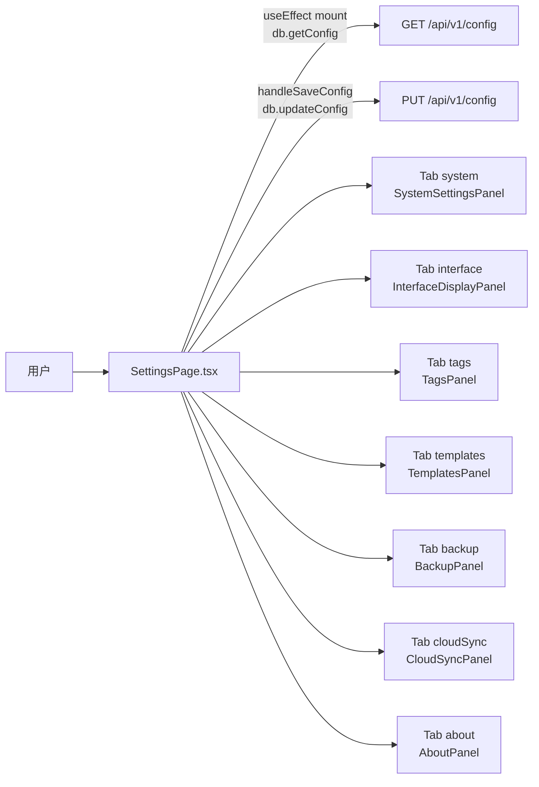

# 更多设置页

> 总览

## 页面简介

更多设置页（SettingsPage）以 `Tabs` 形式承载多个配置面板，Tab 顺序为：系统设置、界面显示、标签管理、模板管理、备份与恢复、云端同步、关于。执行器管理、会话管理、工作空间、Skills 管理、运行管理已独立为左侧导航菜单项，不再嵌套在设置页的标签页中。Tab 切换通过 `useViewState` 同步 URL，支持 popstate 回退。

## 页面级数据流总图

## 功能点索引

- [settings-tab-system](#/help/settings-more/settings-tab-system) — 系统设置 Tab（端口/地址/数据库/日志/时区）
- [settings-tab-interface](#/help/settings-more/settings-tab-interface) — 界面显示 Tab（底部执行日志面板开关）
- [settings-tab-tags](#/help/settings-more/settings-tab-tags) — 标签管理 Tab（创建/删除标签）
- [settings-tab-templates](#/help/settings-more/settings-tab-templates) — 模板管理 Tab（专家/事项/技能/工艺模板同步）
- [settings-tab-backup](#/help/settings-more/settings-tab-backup) — 备份与恢复 Tab（数据库/事项/技能备份 + 导入导出）
- [settings-tab-cloud-sync](#/help/settings-more/settings-tab-cloud-sync) — 云端同步 Tab（bundled 仓库配置 + push/pull）
