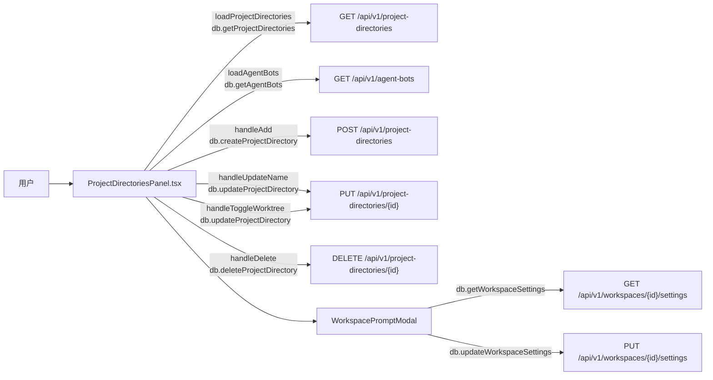

# 工作空间页

> 总览

## 页面简介

工作空间页（ProjectDirectoriesPanel）管理本地项目目录，每个工作空间是 Todo 按「项目」维度分组的依据。页面提供新增（名称 + 路径）、编辑名称、删除、切换 Git Worktree 开关（执行事项时自动创建 git worktree 保持工作区干净）及自动清理开关、基础约定弹窗（工作空间级共识 prompt）。每个工作空间卡还显示已绑定的智能助手数量，点击可联动跳转到消息页。

## 页面级数据流总图

## 功能点索引

- [ws-add](ws-add.md) — 新建工作空间（名称 + 路径）
- [ws-rename](ws-rename.md) — 编辑工作空间名称
- [ws-toggle-worktree](ws-toggle-worktree.md) — Git Worktree / 自动清理开关切换
- [ws-delete](ws-delete.md) — 删除工作空间
- [ws-bot-count](ws-bot-count.md) — 已绑定智能助手数量展示与联动跳转
- [ws-prompt-modal](ws-prompt-modal.md) — 基础约定弹窗（工作空间级 system_prompt）
