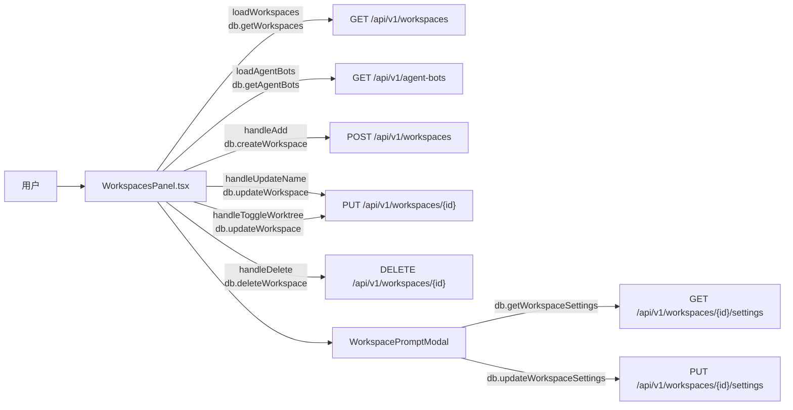

# 工作空间页

> 总览

## 页面简介

工作空间页（WorkspacesPanel）管理本地工作空间，每个工作空间是 Todo 按「项目」维度分组的依据。页面提供新增（名称 + 路径）、编辑名称、删除、切换 Git Worktree 开关（执行事项时自动创建 git worktree 保持工作区干净）及自动清理开关、基础约定弹窗（工作空间级共识 prompt）。每个工作空间卡还显示已绑定的智能助手数量，点击可联动跳转到消息页。

## 页面级数据流总图

