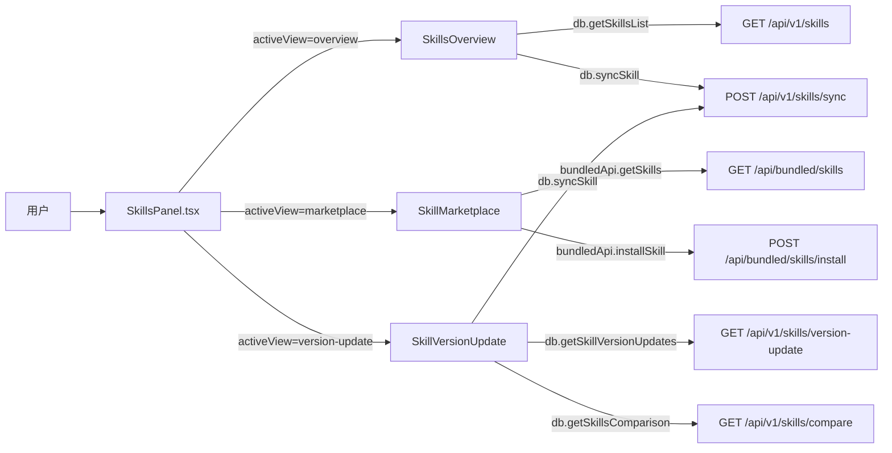

# 技能页

> 总览

## 页面简介

技能页（Skills）是前端设置导航中的独立菜单项，由 `SkillsPanel` 组件承载，通过 `Segmented` 切换三个子视图：总览、技能市场、版本更新。总览用于浏览本地已安装技能并执行导入导出；技能市场用于从内置资源仓库（bundled）安装技能到指定执行器；版本更新用于检测各执行器间技能版本差异并一键同步。

## 页面级数据流总图

## 功能点索引

- [skills-view-switch](skills-view-switch.md) — 总览/市场/版本更新子视图切换
- [skills-overview](skills-overview.md) — 已安装技能总览（搜索、执行器筛选、卡片/列表视图、导入导出）
- [skills-marketplace](skills-marketplace.md) — 技能市场（来源浏览、全部技能、安装到执行器）
- [skills-version-update](skills-version-update.md) — 版本更新检测与一键同步
