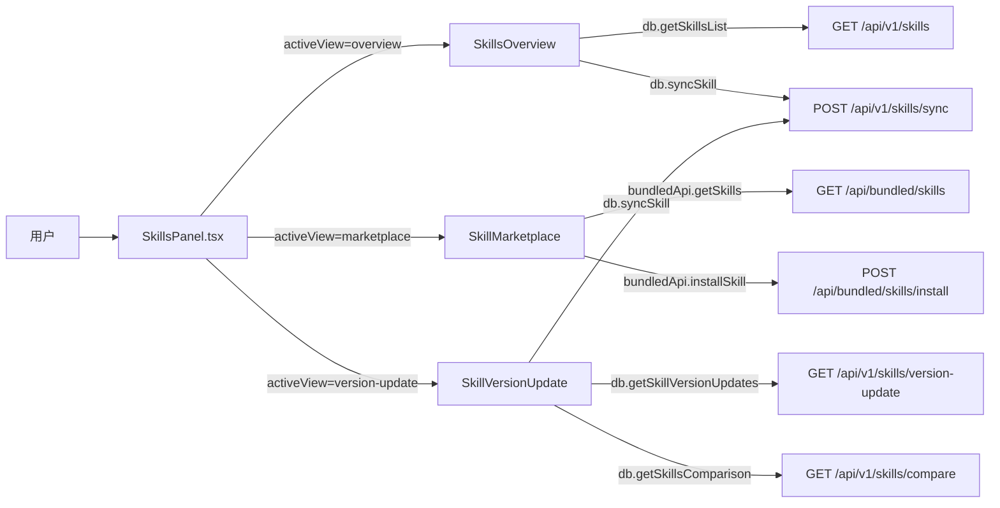

# 技能页

> 总览

## 页面简介

技能页（Skills）是前端设置导航中的独立菜单项，由 `SkillsPanel` 组件承载，通过 `Segmented` 切换三个子视图：总览、技能市场、版本更新。总览用于浏览本地已安装技能并执行导入导出；技能市场用于从内置资源仓库（bundled）安装技能到指定执行器；版本更新用于检测各执行器间技能版本差异并一键同步。

## 页面级数据流总图

