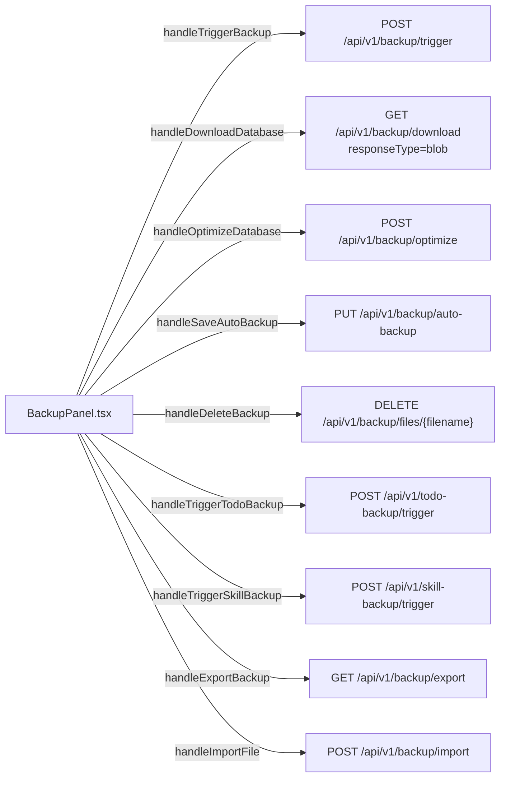
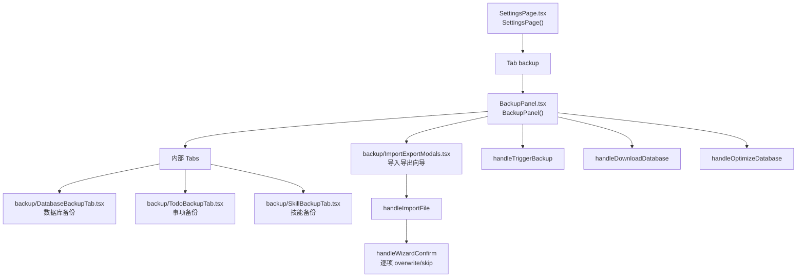
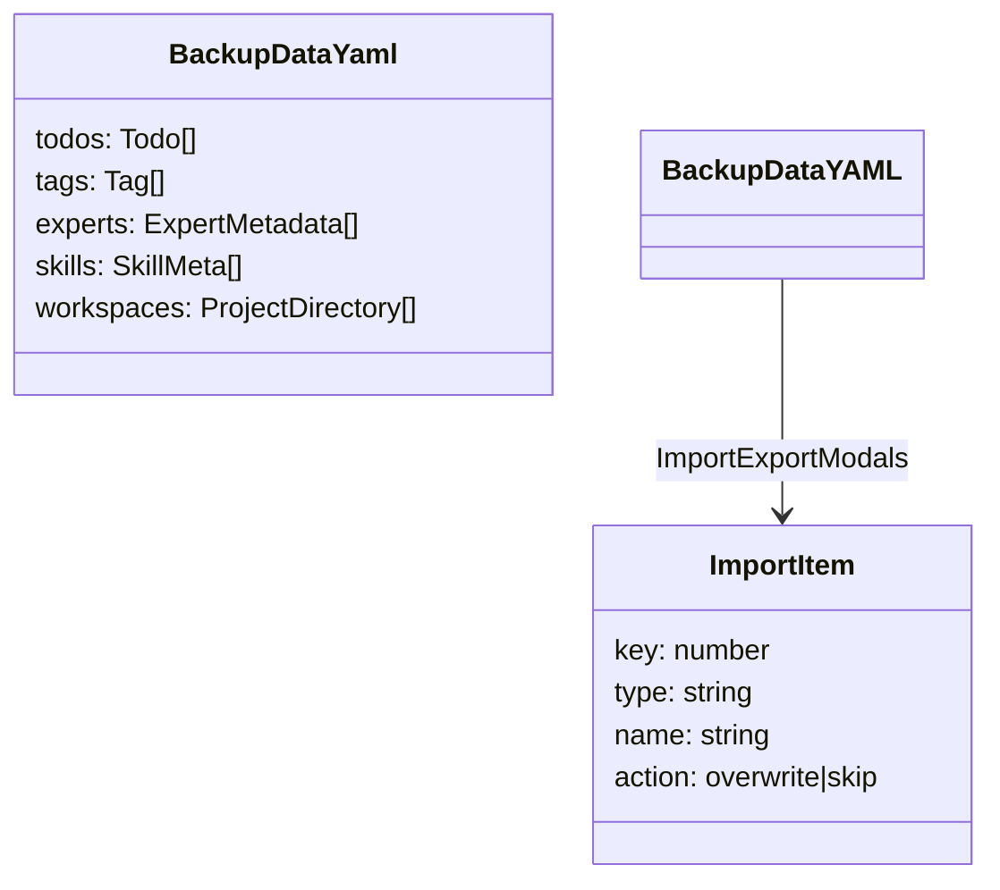
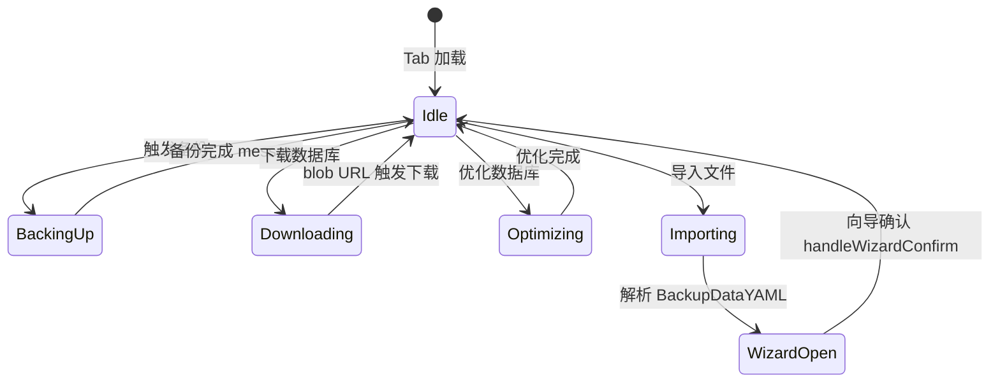

# 备份与恢复 Tab

## 功能位置
更多设置页 →「备份与恢复」Tab（`BackupPanel`）

## 数据流图（前端 → 后端）

## 谑用关系链路图

## 数据结构图

## 数据变更图

## 开发指导
- **前端入口**：`frontend/src/components/settings/BackupPanel.tsx` 的 `BackupPanel` 组件；内部 Tabs 分数据库/事项/技能备份，导入导出由 `backup/ImportExportModals.tsx` 承载
- **后端入口**：`backend/src/handlers/backup.rs` 处理数据库备份/恢复/优化/导入导出；事项备份和技能备份见对应 handler
- **注意**：导入向导用 `ImportItem` 的 `overwrite` / `skip` 逐项控制冲突处理策略；`handleDownloadDatabase` 用 `responseType=blob` 接收二进制后 `URL.createObjectURL` 触发下载
- **扩展**：新增备份子类（如工艺模板备份）时内部 Tabs 追加子 Tab，后端追加对应 trigger/auto-backup/files 接口
