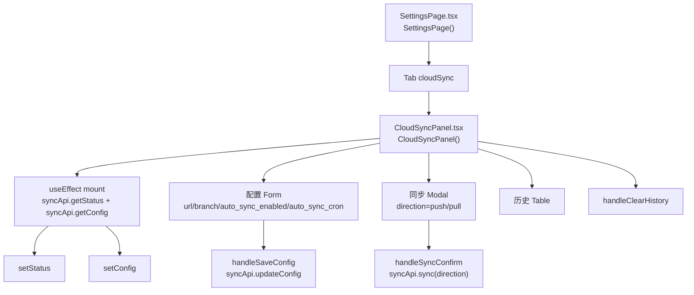
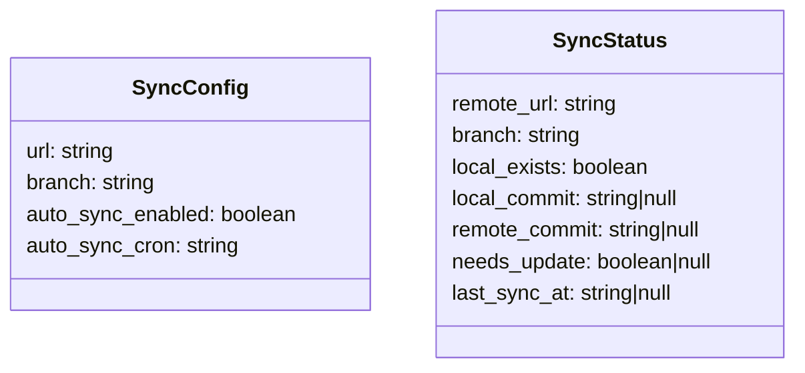
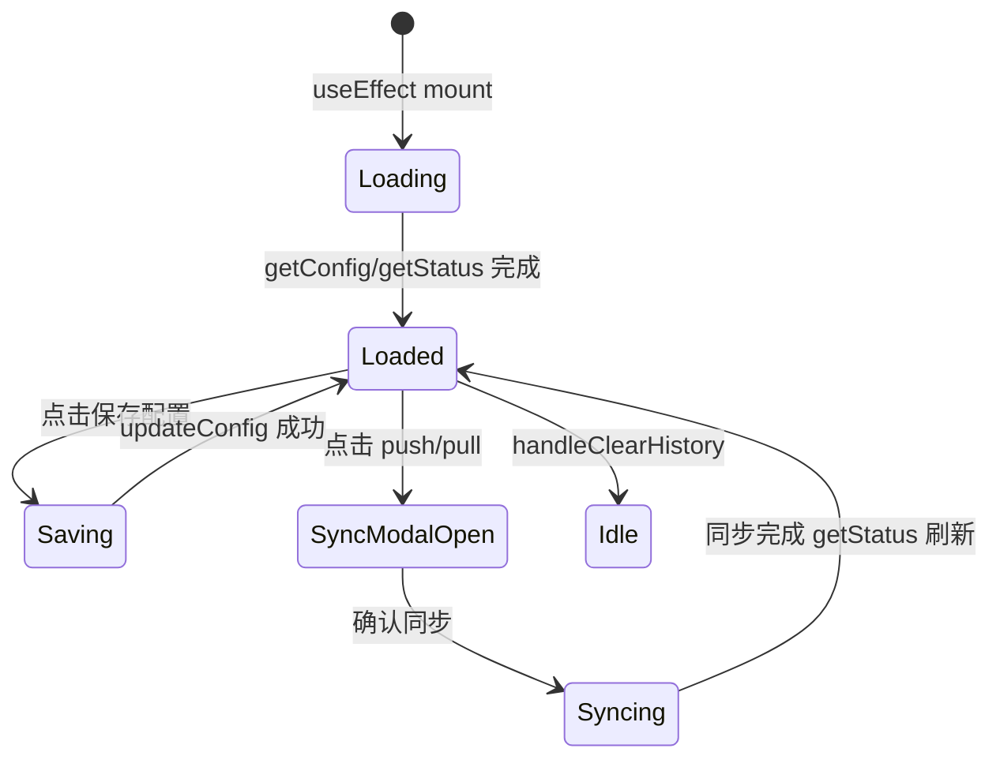

# 云端同步 Tab

## 功能位置
更多设置页 →「云端同步」Tab（`CloudSyncPanel`）

## 数据流图（前端 → 后端）

```mermaid
flowchart LR
  CloudSyncPanel["CloudSyncPanel.tsx"] -->|"useEffect mount<br>syncApi.getStatus"| API1["GET /api/v1/sync/status"]
  CloudSyncPanel --> -->|"handleSaveConfig<br>syncApi.updateConfig"| API2["PUT /api/v1/sync/config"]
  CloudSyncPanel -->|"handleSyncConfirm<br>syncApi.sync"| API3["POST /api/v1/sync"]
  API3 -->|"direction=push/pull"| API3
  CloudSyncPanel -->|"handleClearHistory"| API4["DELETE /api/v1/sync/history"]
```

## 谑用关系链路图



## 数据结构图



## 数据变更图



## 开发指导
- **前端入口**：`frontend/src/components/settings/CloudSyncPanel.tsx` 的 `CloudSyncPanel` 组件；`syncApi` 来自 `frontend/src/utils/database/sync`
- **后端入口**：`backend/src/handlers/sync.rs` 处理 `/api/v1/sync` 系列接口（status / config / sync / history）
- **注意**：同步方向分 `push`（本地→远程）和 `pull`（远程→本地），确认弹窗中展示方向语义；`needs_update` 为 null 表示尚未比较过本地远程 commit
- **扩展**：新增同步方向（如 `bidirectional`）后端 sync handler 追加分支，前端 `openSyncModal` 的 direction union 扩展
