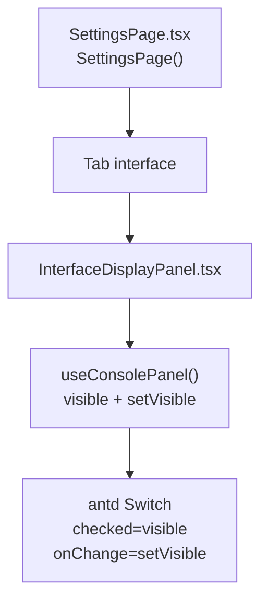
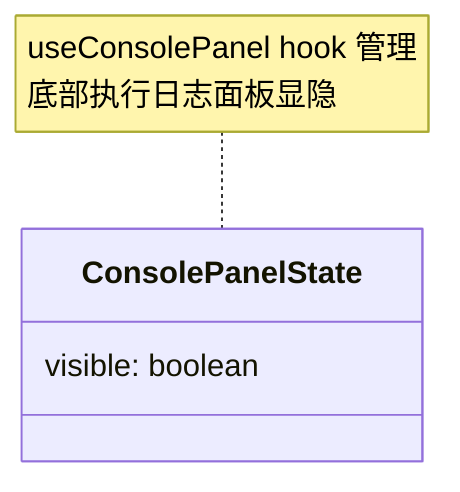
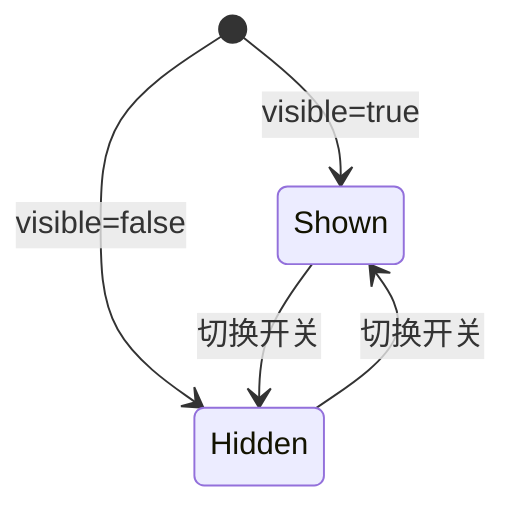

# 界面显示 Tab

## 功能位置
更多设置页 →「界面显示」Tab（`InterfaceDisplayPanel`）

## 数据流图（前端 → 后端）

## 调用关系链路图

## 数据结构图

## 数据变更图

## 开发指导
- **前端入口**：`frontend/src/components/settings/InterfaceDisplayPanel.tsx` 的 `InterfaceDisplayPanel` 组件；`useConsolePanel` hook 来自 `frontend/src/hooks/useConsolePanel`
- **后端入口**：无后端调用，纯前端 UI 偏好
- **注意**：关闭后即使有运行中任务也不会弹出底部日志框，日志数据仍在 `state.runningTasks` 中正常累积，重新打开即可立刻看到
- **扩展**：后续如有其他纯前端 UI 偏好（如列表密度、字号）可在本 Tab 追加对应开关
