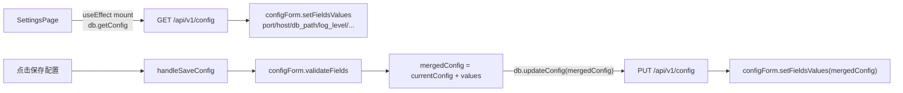
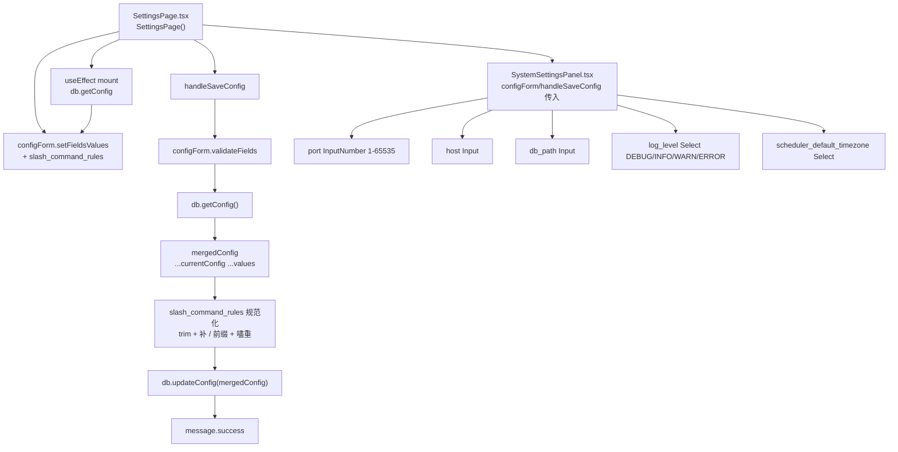
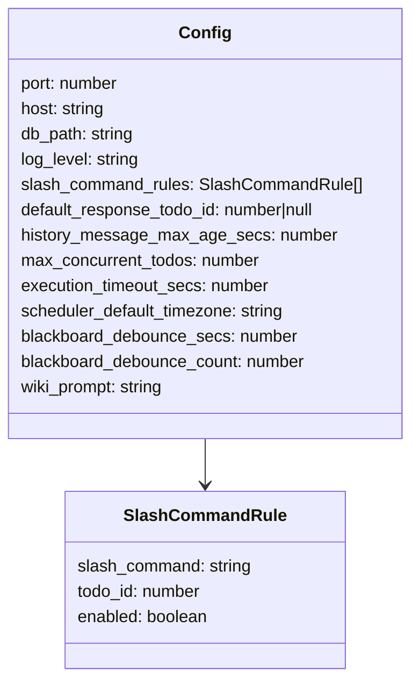
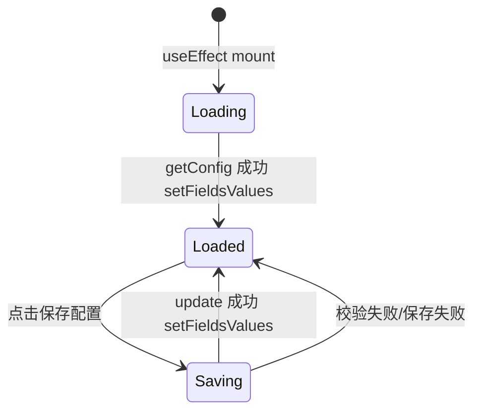

# 系统设置 Tab

## 功能位置
更多设置页 →「系统设置」Tab（默认 Tab，`SystemSettingsPanel`）

## 数据流图（前端 → 后端）

## 调用关系链路图

## 数据结构图

## 数据变更图

## 开发指导
- **前端入口**：`frontend/src/components/SettingsPage.tsx` 的 `handleSaveConfig` 回调；`frontend/src/components/settings/SystemSettingsPanel.tsx` 承载表单字段
- **后端入口**：`backend/src/handlers/config.rs` 处理 `GET /api/v1/config`、`PUT /api/v1/config`
- **注意**：`handleSaveConfig` 做 `slash_command_rules` 规范化（trim + 补 `/` 前缀 + 嚍重检查），重复命令会 `message.error` 并阻断保存；`mergedConfig` 先取 `currentConfig` 再 spread `values`，保证未表单管理的字段不被清空
- **扩展**：新增配置字段时 `Config` 类型追加键，`SystemSettingsPanel` 添加 `Form.Item`，`handleSaveConfig` 的 mergedConfig 构造追加该键的处理
