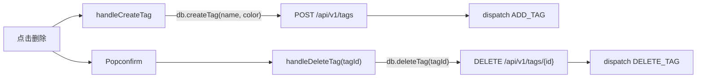
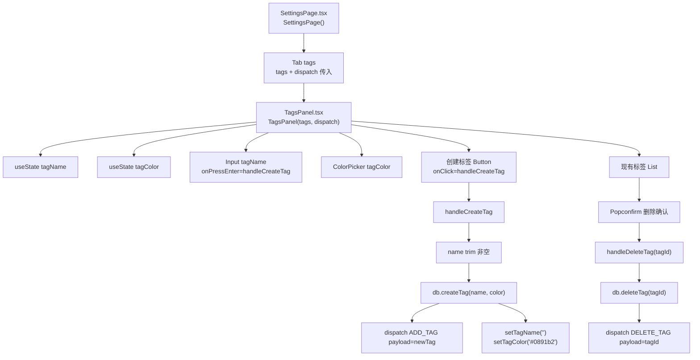
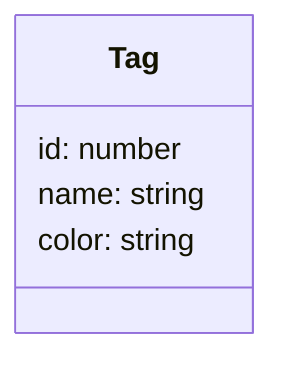
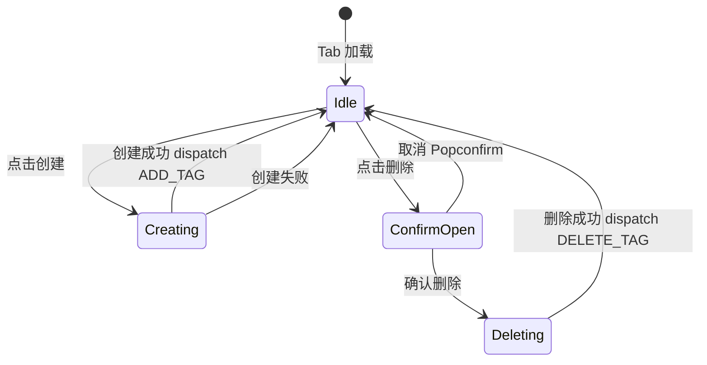

# 标签管理 Tab

## 功能位置
更多设置页 →「标签管理」Tab（`TagsPanel`）

## 数据流图（前端 → 后端）

## 调用关系链路图

## 数据结构图

## 数据变更图

## 开发指导
- **前端入口**：`frontend/src/components/settings/TagsPanel.tsx` 的 `TagsPanel` 组件；`tags` 和 `dispatch` 由 `SettingsPage` 从 `useApp` 传入
- **后端入口**：`backend/src/handlers/tag.rs` 处理 `POST /api/v1/tags`、`DELETE /api/v1/tags/{id}`、`GET /api/v1/tags`
- **注意**：创建成功后 `dispatch ADD_TAG` 让全局 state 同步；标签颜色默认 `#0891b2`，创建后重置色值
- **扩展**：如需标签分组或排序，`Tag` 类型扩展 `group` 字域，`TagsPanel` 的 `List` dataSource 按分组渲染
