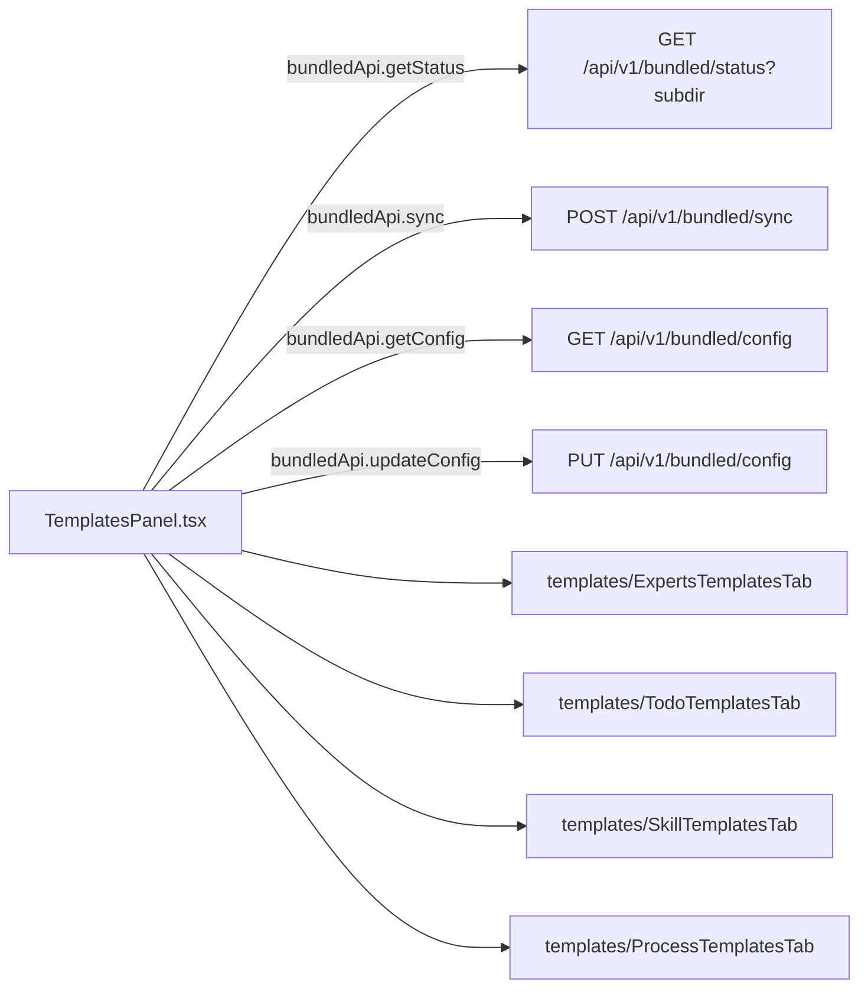
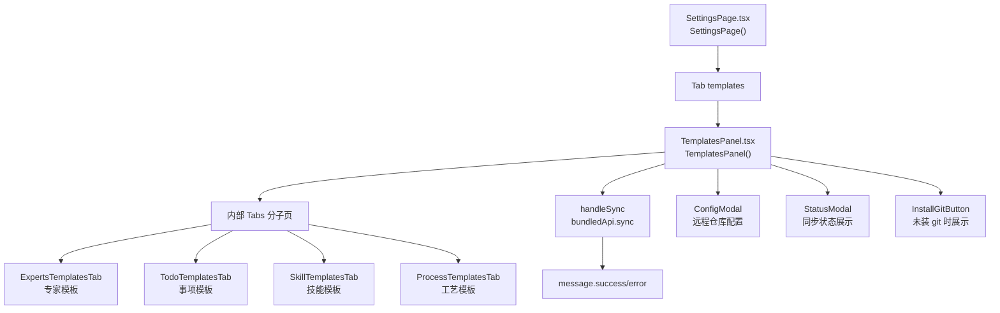
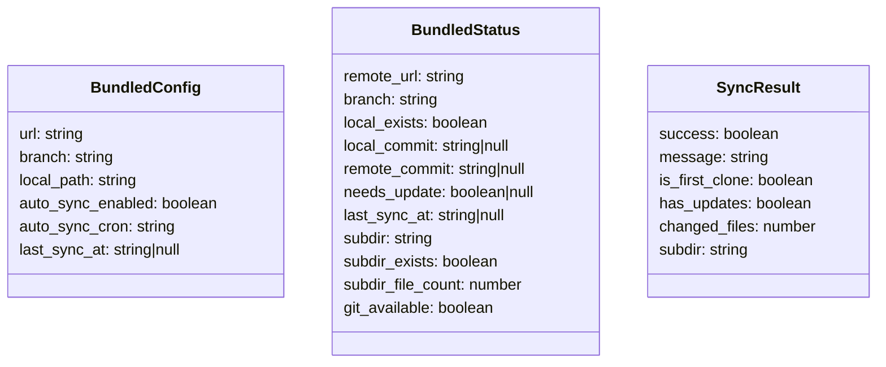
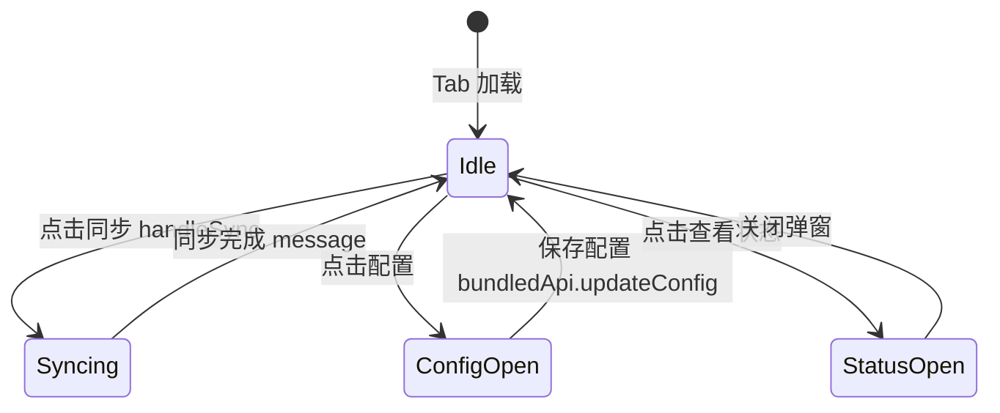

# 模板管理 Tab

## 功能位置
更多设置页 →「模板管理」Tab（`TemplatesPanel`）

## 数据流图（前端 → 后端）

## 调用关系链路图

## 数据结构图

## 数据变更图

## 开发指导
- **前端入口**：`frontend/src/components/settings/TemplatesPanel.tsx` 的 `TemplatesPanel` 组件；内部 Tabs 分专家/事项/技能/工艺模板，各子 Tab 由 `templates/` 下独立组件承载
- **后端入口**：`backend/src/handlers/bundled.rs` 处理 `/api/v1/bundled/*` 系列接口
- **注意**：同步前需检查 `git_available`，未安装 git 时展示 `InstallGitButton`；`handleSync` 的结果用 `SyncResult.is_first_clone` 区分首次克隆与后续 fetch
- **扩展**：新增模板子目录类型时 `Subdir` union 追加值，`TemplatesPanel` 内部 Tabs 新增对应子 Tab 组件
