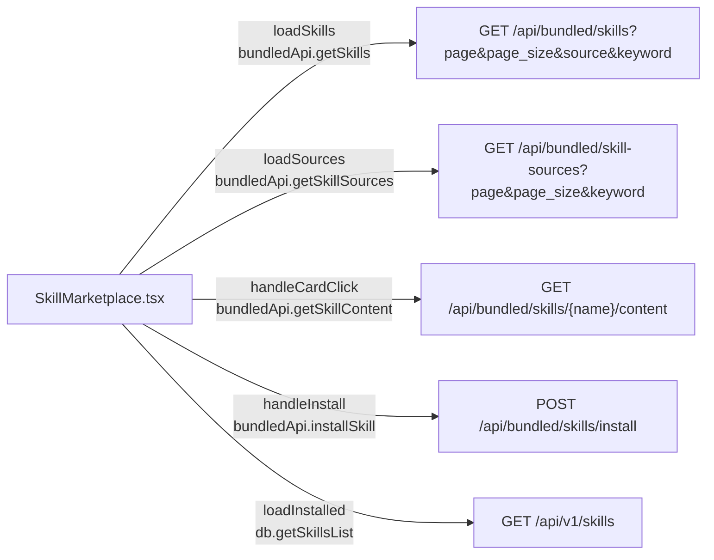
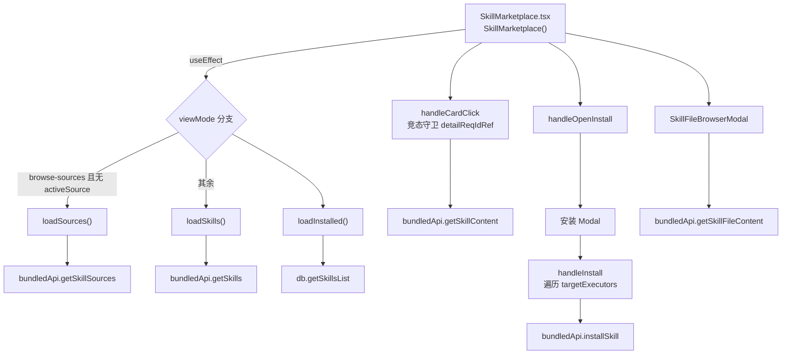
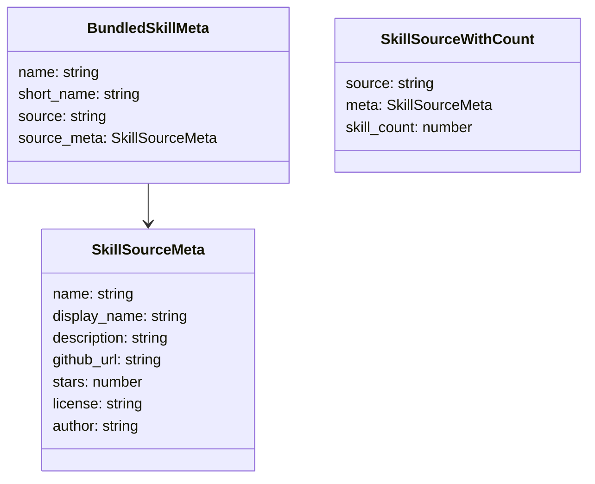
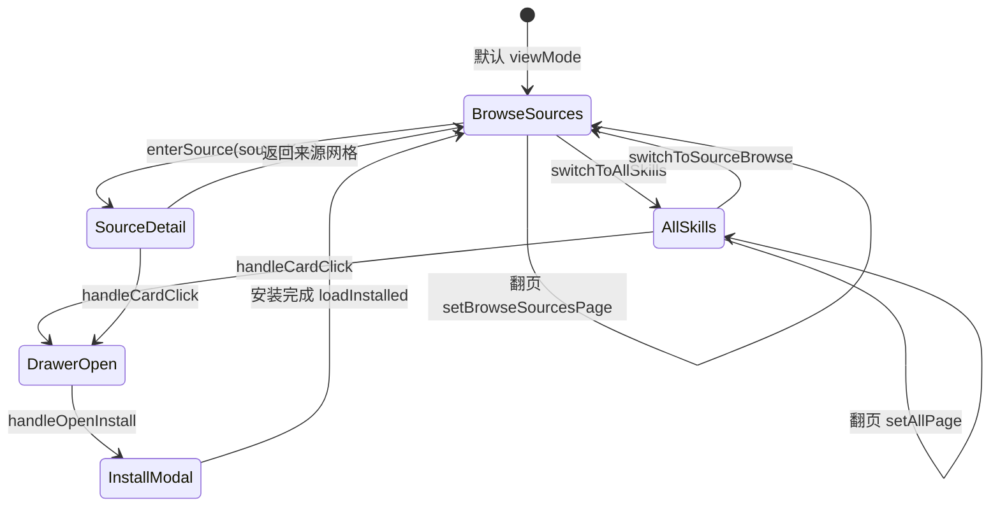

# 技能市场

## 功能位置
技能页 →「技能市场」子视图（`Segmented` 第二项）

## 数据流图（前端 → 后端）

## 调用关系链路图

## 数据结构图

## 数据变更图

## 开发指导
- **前端入口**：`frontend/src/components/skills/SkillMarketplace.tsx` 的 `SkillMarketplace` 组件
- **后端入口**：`backend/src/handlers/bundled.rs` 处理 `/api/bundled/skills` 系列接口
- **注意**：`loadSkills` 与 `loadSources` 共用 `reqGenRef` 做竞态守卫，快速翻页/切换视图时过期请求静默丢弃；`handleCardClick` 用独立的 `detailReqIdRef` 防止详情内容覆盖
- **扩展**：新增来源只需在 `~/.ntd/bundled/skills/` 下放置来源目录及 `metadata.json`，后端扫描即自动识别；前端 `ALL_SKILLS_PAGE_SIZE` 控制每页条数（默认 30）
