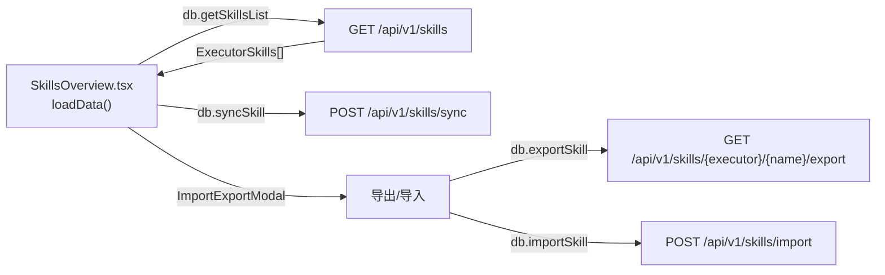
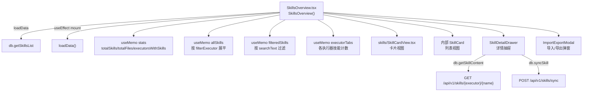
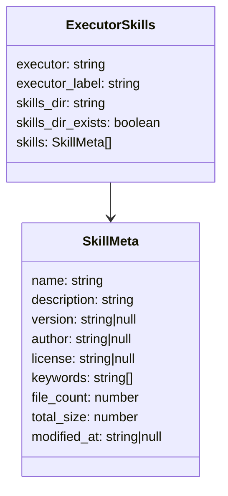
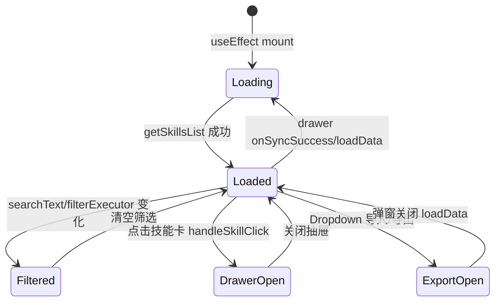

# 已安装技能总览

## 功能位置
技能页 →「总览」子视图（`Segmented` 默认值）

## 数据流图（前端 → 后端）

## 调用关系链路图

## 数据结构图

## 数据变更图

## 开发指导
- **前端入口**：`frontend/src/components/skills/SkillsOverview.tsx` 的 `SkillsOverview` 组件，`loadData` 触发首次加载
- **后端入口**：`backend/src/handlers/skills.rs` 处理 `GET /api/v1/skills`、`POST /api/v1/skills/sync`
- **注意**：`stats.totalExecutors` 使用前端常量 `EXECUTORS.length` 而非 API 返回数量，因为 API 只返回有 skills 目录的执行器
- **扩展**：新增执行器时在 `frontend/src/types/execution.tsx` 的 `EXECUTORS` 数组追加条目，`EXECUTOR_COLORS` 映射色值即可
