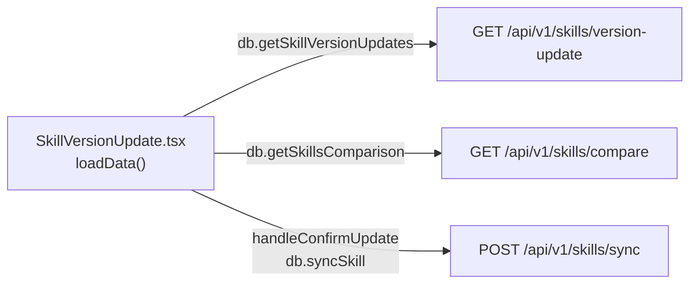
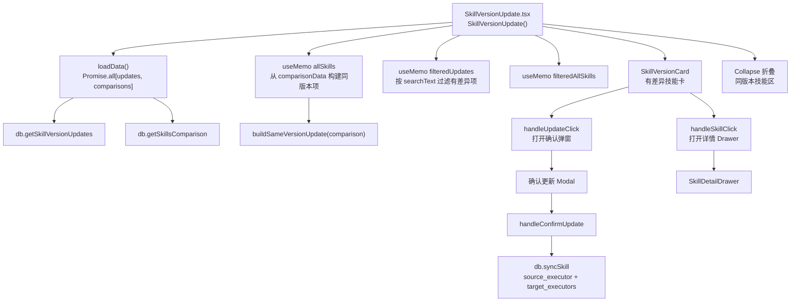
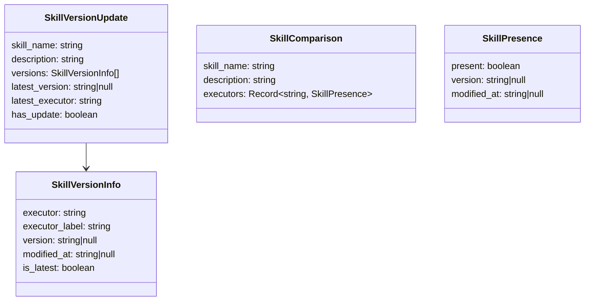
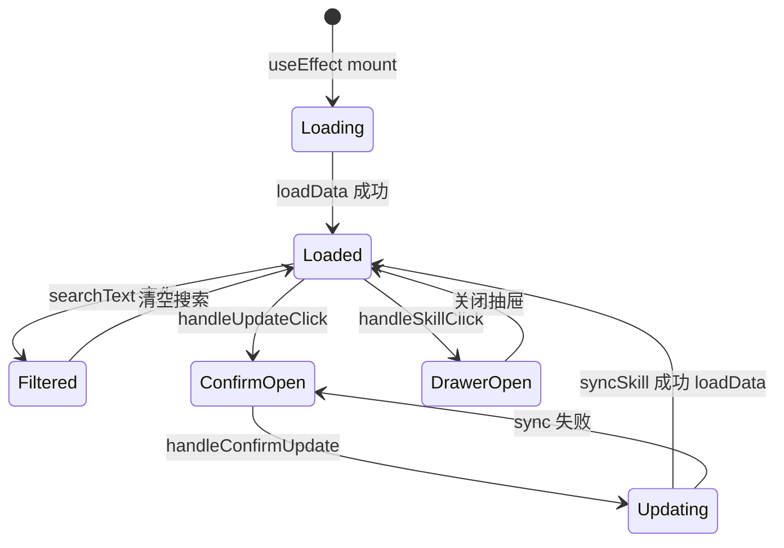

# 版本更新

## 功能位置
技能页 →「版本更新」子视图（`Segmented` 第三项）

## 数据流图（前端 → 后端）

## 调用关系链路图

## 数据结构图

## 数据变更图

## 开发指导
- **前端入口**：`frontend/src/components/skills/SkillVersionUpdate.tsx` 的 `SkillVersionUpdate` 组件，`buildSameVersionUpdate` 将无差异的 `SkillComparison` 转为展示用的 `SkillVersionUpdate` 结构
- **后端入口**：`backend/src/handlers/skills.rs` 处理 `GET /api/v1/skills/version-update`、`GET /api/v1/skills/compare`、`POST /api/v1/skills/sync`
- **注意**：`handleConfirmUpdate` 只同步 `!v.is_latest` 的执行器，从 `latest_executor` 复制到 `targetExecutors`，会覆盖目标执行器同名 skill
- **扩展**：新增版本比对维度需同时改 `SkillComparison.executors` 映射键和 `buildSameVersionUpdate` 的判断逻辑
