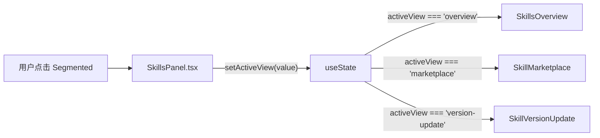
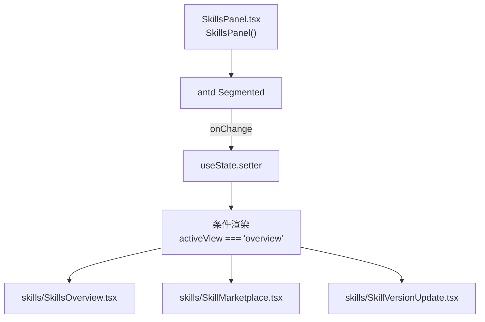
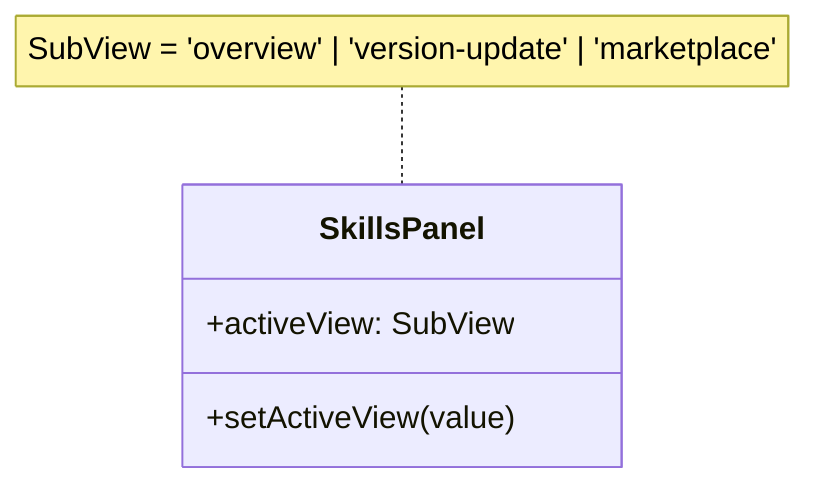

# 子视图切换

## 功能位置
技能页 → 页面卡片右上角 `Segmented` 分段控件（总览 / 技能市场 / 版本更新）

## 数据流图（前端 → 后端）



## 调用关系链路图



## 数据结构图



## 数据变更图

```mermaid
stateDiagram-v2
  [*] --> overview: 默认值 useState('overview')
  overview --> marketplace: 点击「技能市场」
  marketplace --> overview: 点击「总览」
  overview --> version-update: 点击「版本更新」
  version-update --> overview: 点击「总览」
  marketplace --> version-update: 点击「版本更新」
  version-update --> marketplace: 点击「技能市场」
```

## 开发指导
- **前端入口**：`frontend/src/components/SkillsPanel.tsx` 的 `SkillsPanel` 组件，`Segmented` 的 `onChange` 回调
- **后端入口**：无后端调用，纯前端 state 切换
- **注意**：`SubView` 类型已移除 `sync`、`trace`、`compare` 三个使用频率低的子视图，新增子视图需同时扩展 `views` 数组和 `SubView` 类型
- **扩展**：新增子视图时在 `views` 数组追加 `{ label, value }` 并在 JSX 添加条件渲染分支即可
