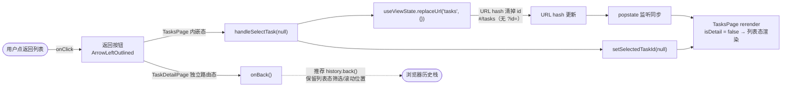
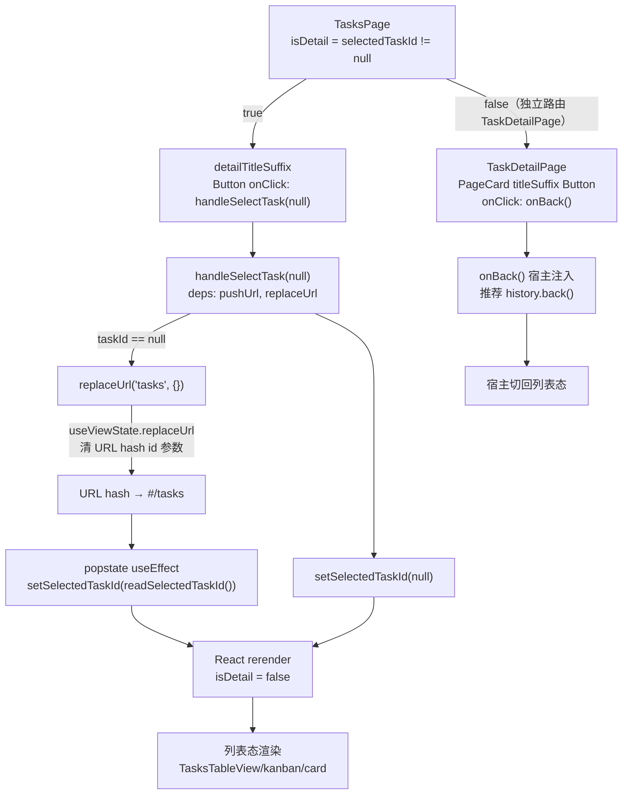
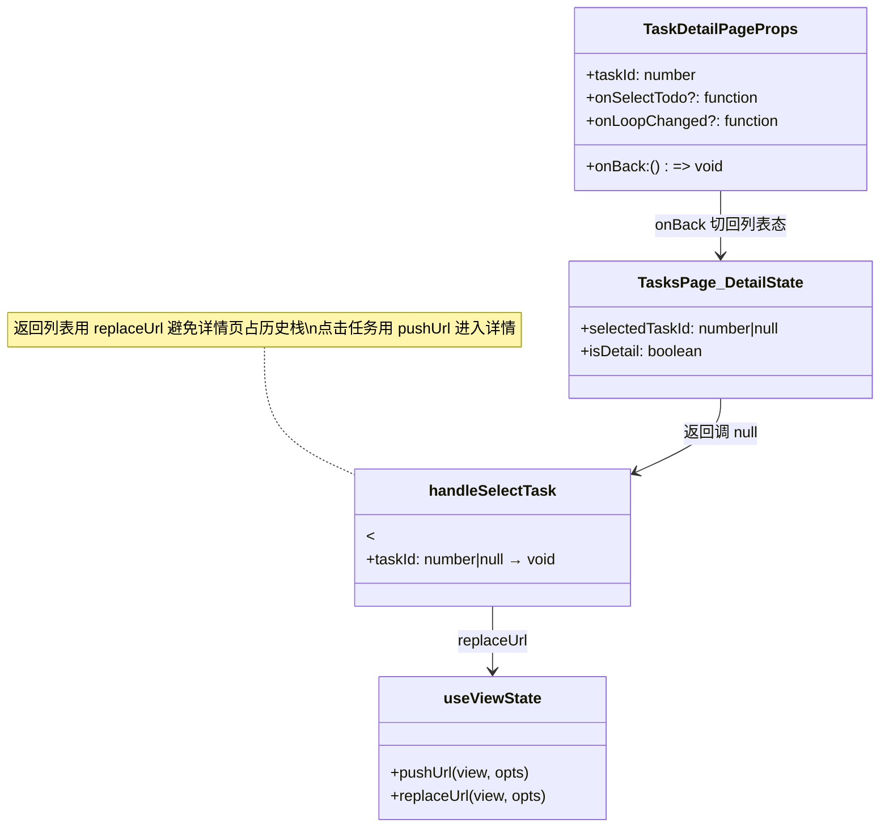
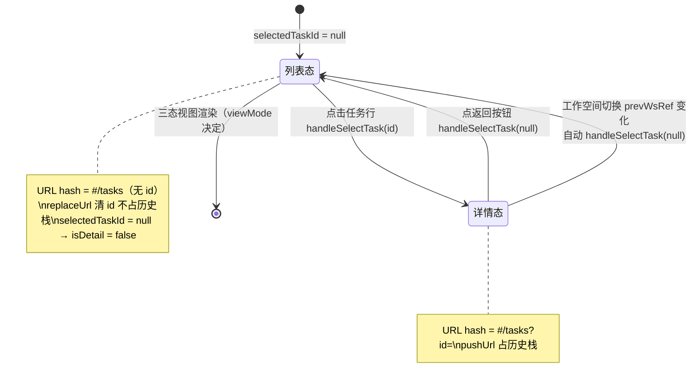

# 返回列表

## 功能位置

任务（详情） → `PageCard` 页头 extra 区最右端的「返回列表」按钮（`ArrowLeftOutlined`）。062 起返回按钮统一走 `PageCard` 的 `onBack` prop（固定右上角锡点，各详情页不再手写 `titleSuffix` 按钮）；`TasksPage` 内嵌态与独立路由 `TaskDetailPage` 均同。

## 数据流图（前端 → 后端）

## 调用关系链路图

## 数据结构图

## 数据变更图

## 开发指导

- **前端入口**：062 起返回按钮由 `frontend/src/components/common/PageCard.tsx` 统一渲染（传 `onBack` 即在 extra 区最右端出现，文案默认「返回列表」可用 `backLabel` 覆盖）。`TasksPage.tsx` 详情态传 `onBack={() => handleSelectTask(null)}`，`handleSelectTask` `useCallback`（deps `[pushUrl, replaceUrl]`）；独立路由态 `TaskDetailPage.tsx` 将宿主注入的 `onBack` 直接透传给 `PageCard`
- **后端入口**：无后端调用。返回列表是纯前端路由态切换，不触发任何 API
- **注意**：返回列表用 `replaceUrl('tasks', {})` 而非 `pushUrl`，清掉 URL hash id 参数且不占历史栈（点任务进详情才用 `pushUrl`）；`setSelectedTaskId(null)` 手动同步确保 SPA 内点击立即响应，`popstate` 监听是浏览器前进/后退时的兜底同步；工作空间切换时若处于详情态会自动 `handleSelectTask(null)`（`prevWsRef` 比较，详情 id 属于旧工作空间继续停留无意义）；独立路由态 `onBack` 推荐宿主注入 `history.back()`，保留列表态筛选/滚动位置
- **扩展**：若需返回时保留详情态的某个 scroll 位置，在 `handleSelectTask(null)` 前用 ref 记录并通过 `replaceUrl` 的 `opts` 透传；新增其他退出详情态的入口（如键盘 ESC）时复用 `handleSelectTask(null)` 硑
