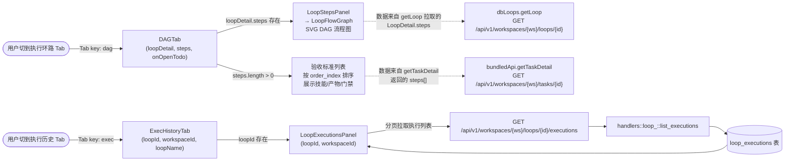
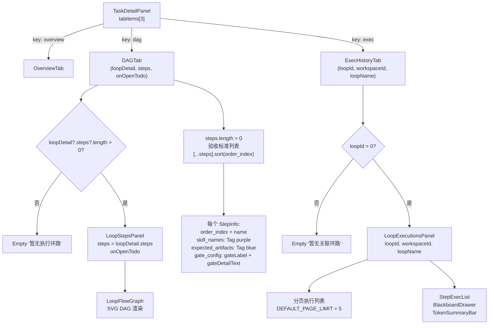
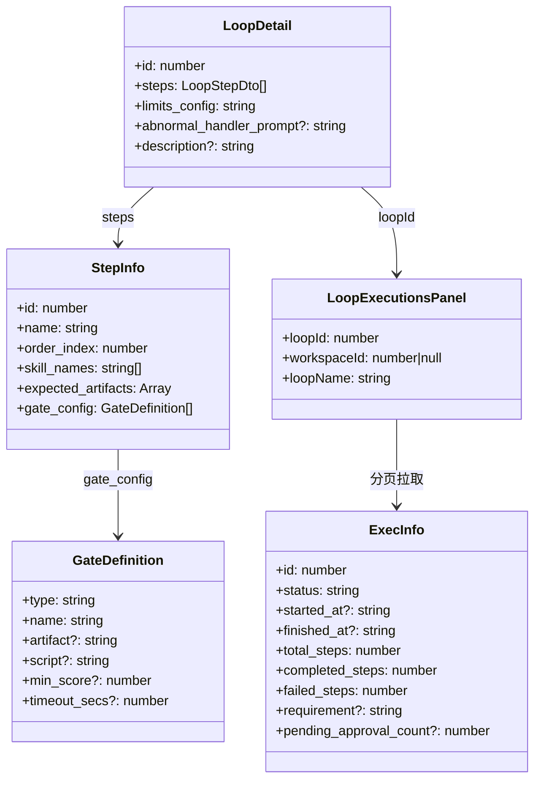
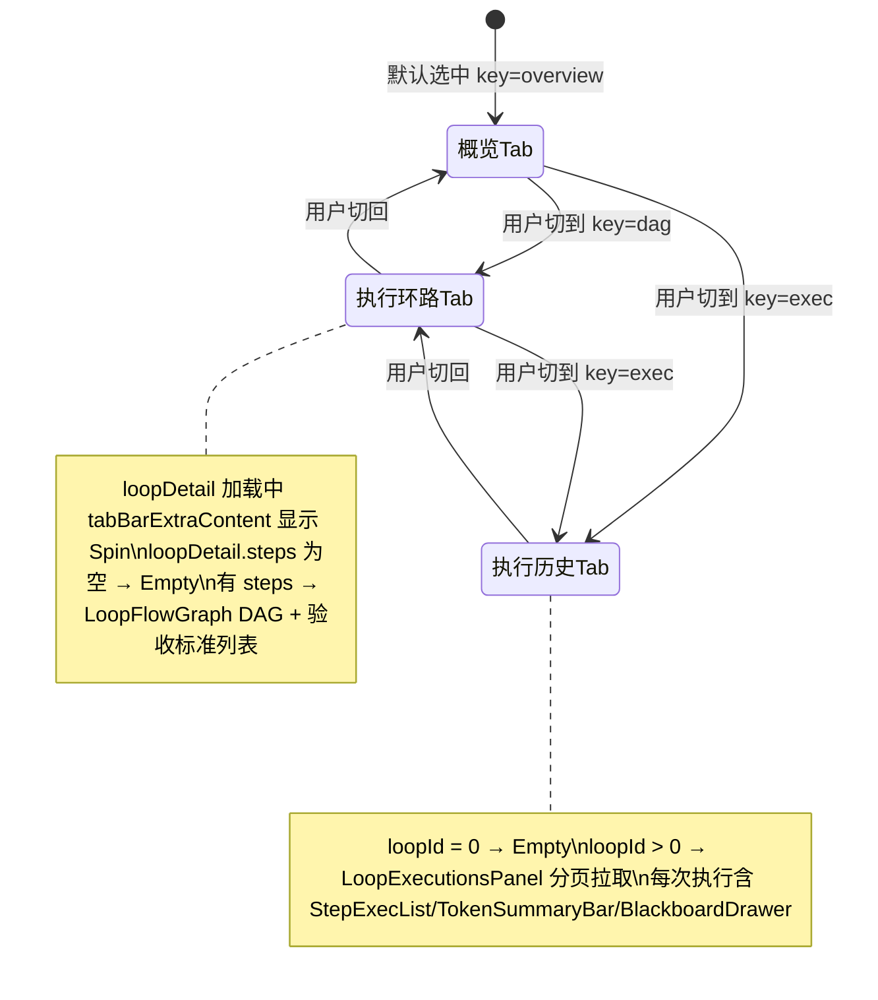

# 查看任务 DAG / 执行历史

## 功能位置

任务（详情） → `TaskDetailPanel` 内 `Tabs`「执行环路」Tab（DAG 流程图 + 验收标准）和「执行历史」Tab（分页执行列表）

## 数据流图（前端 → 后端）

## 调用关系链路图

## 数据结构图

## 数据变更图

## 开发指导

- **前端入口**：`frontend/src/components/tasks/TaskDetailPanel.tsx` 的 `tabItems` 数组（`DAGTab` 和 `ExecHistoryTab`）；Tab 子组件定义在 `frontend/src/components/tasks/TaskDetailTabs.tsx`，`DAGTab` 内用 `LoopStepsPanel`（`frontend/src/components/LoopStudioStepsPanel.tsx`）渲染 DAG，`ExecHistoryTab` 内用 `LoopExecutionsPanel`（`frontend/src/components/loop-studio/executions/index.tsx`）渲染历史
- **后端入口**：DAG 数据来自 `dbLoops.getLoop`（`GET /api/v1/workspaces/{ws}/loops/{id}`）返回的 `LoopDetail.steps`；验收标准 `steps[]` 来自 `bundledApi.getTaskDetail`（`GET /api/v1/workspaces/{ws}/tasks/{id}`）→ `handlers::tasks::get_task_detail` → `db.list_loop_steps_by_loop`；执行历史走 `LoopExecutionsPanel` 内的分页 API（`GET /api/v1/workspaces/{ws}/loops/{id}/executions`）
- **注意**：DAG Tab 数据有两个来源——流程图用 `loopDetail.steps`（`LoopStepDto[]`，来自 `dbLoops.getLoop`），验收标准用 `detail.steps`（`StepInfo[]`，来自 `getTaskDetail`），两者口径不同不可混用；`loopDetail` 加载中时 `Tabs` 的 `tabBarExtraContent` 显示小 `Spin`；`DAGTab` 在 `loopDetail` 为 null 或 `steps` 为空时显示 `Empty '暂无执行环路'`；`ExecHistoryTab` 在 `loopId` 为 0 时显示 `Empty '暂无关联环路'`；`getTaskDetail` 返回的 `executions` 列表（`ExecInfo[]`，`LIMIT 20`）只用于概览态，执行历史 Tab 走 `LoopExecutionsPanel` 分页拉取
- **扩展**：新增 Tab 时在 `TaskDetailPanel` 的 `tabItems` 数组加项，对应子组件仿照 `DAGTab`/`ExecHistoryTab` 模式拆分到 `TaskDetailTabs.tsx`；新增验收标准展示字段时在 `StepInfo` 接口加字段，`DAGTab` 的 `gate_item` 渲染分支加对应展示
