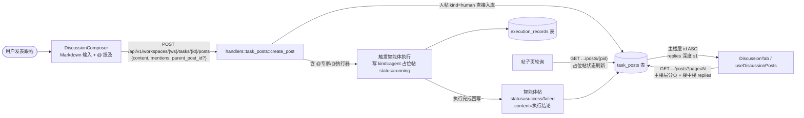
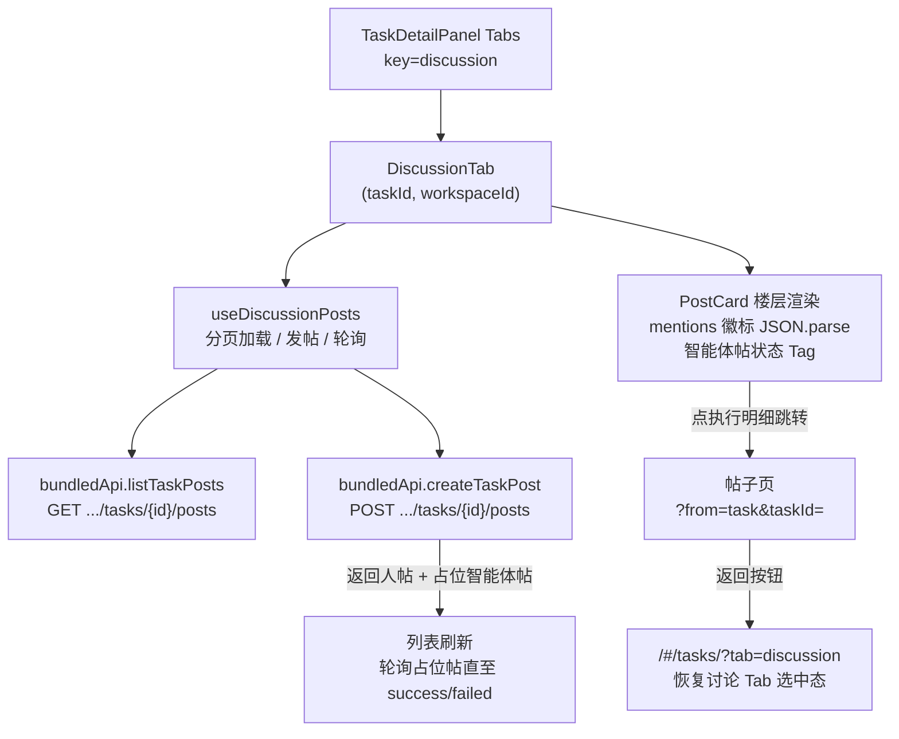
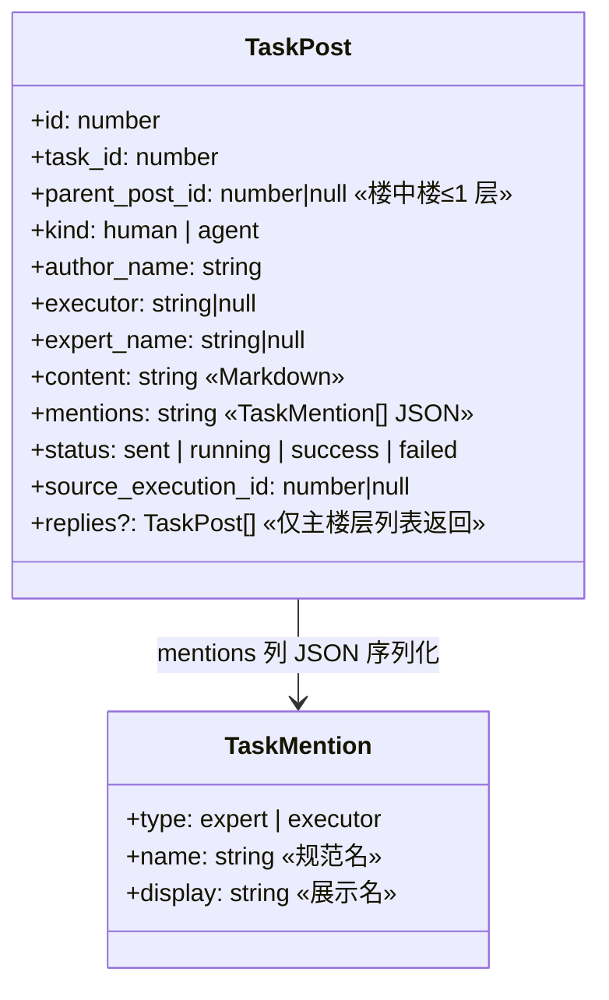
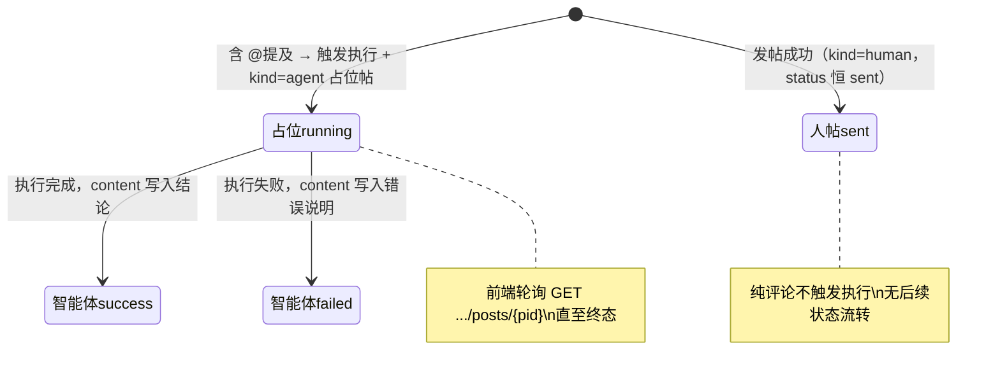

# 讨论区（论坛跟帖 + @触发执行）

## 功能位置

任务（详情） → Tab 4「讨论」（060 新增）。论坛式楼层列表 + 底部编辑器（`DiscussionComposer`），正文支持 Markdown；人帖中 `@专家名` / `@执行器名` 会触发对应智能体执行，执行结论以智能体帖自动回楼。

## 数据流图（前端 → 后端）

## 调用关系链路图

## 数据结构图

## 数据变更图

## 开发指导

- **前端入口**：`frontend/src/components/tasks/discussion/`——`DiscussionTab`（Tab 容器）、`useDiscussionPosts`（分页/发帖/轮询 hook）、`PostCard`（楼层 + mentions 徽标）、`DiscussionComposer`（编辑器 + @ 提及）；类型在 `frontend/src/types/task.ts`（`TaskPost` / `TaskMention`）。
- **后端入口**：`backend/src/handlers/task_posts.rs`——`GET .../posts`（主楼层分页 + replies 组装）、`GET .../posts/{pid}`（单帖，轮询用）、`POST .../posts`（人帖入库 + @ 触发执行 + 占位帖）；mentions 以 JSON 字符串存 `task_posts.mentions` 列。
- **注意**：楼中楼深度 ≤1（仅允许回复主楼层）；人帖 `status` 恒 `sent`，只有智能体帖有 running/success/failed 流转；从讨论 Tab 跳入帖子页时 URL 带 `?from=task&taskId=<id>`，返回据此回到 `#/tasks/<id>?tab=discussion`（TAB_KEYS 白名单含 discussion）。
- **扩展**：新增提及类型时在 `TaskMention.type` 加枚举值、后端 `create_post` 的触发分支加对应执行路径；智能体帖的 `source_execution_id` 已支持跳转执行明细。
