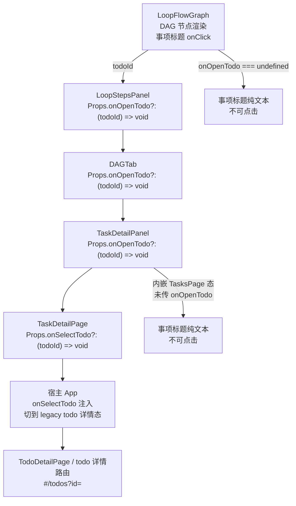
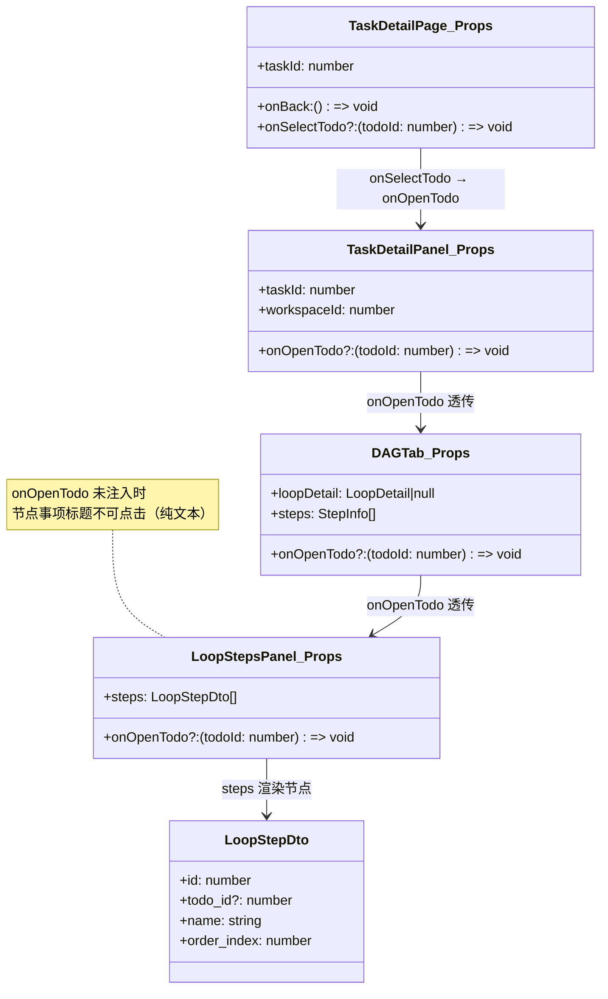
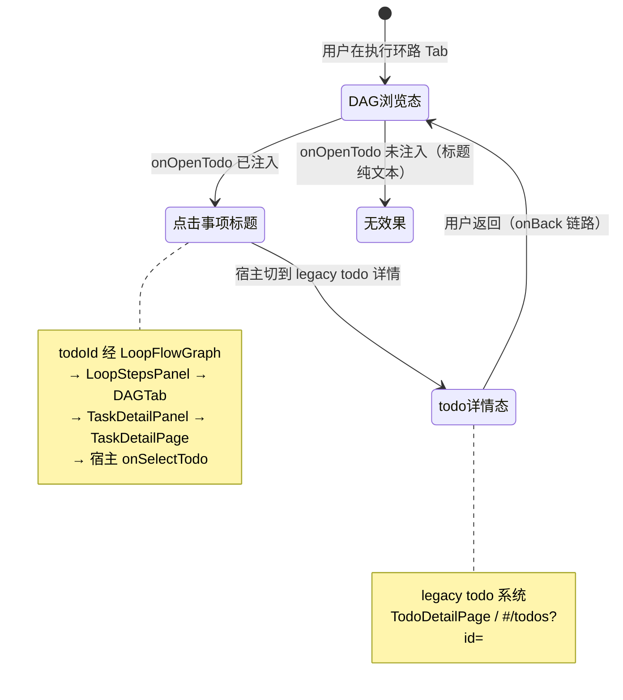

# DAG 节点跳转事项

## 功能位置

任务（详情） → 执行环路 Tab → `LoopStepsPanel` → `LoopFlowGraph` DAG 节点上的事项标题可点击 → `onOpenTodo(todoId)` 跳转 legacy todo 详情

## 数据流图（前端 → 后端）

```mermaid
flowchart LR
  U([用户点击 DAG 节点事项标题]) -->|"onClick todoId"| flow["LoopFlowGraph<br/>节点事项标题"]
  flow -->|"onOpenTodo(todoId)"| steps_panel["LoopStepsPanel<br/>onOpenTodo prop"]
  steps_panel -->|"onOpenTodo prop 透传"| dag_tab["DAGTab<br/>onOpenTodo"]
  dag_tab -->|"onOpenTodo prop 透传"| panel["TaskDetailPanel<br/>onOpenTodo"]
  panel -->|"onOpenTodo prop 透传"| detail_page["TaskDetailPage<br/>onSelectTodo"]
  detail_page -->|"宿主注入跳转逻辑"| host([宿主 App<br/>切到 todo 详情态])
  host -.->|"legacy todo 系统<br/>可能调 GET /api/v1/todos/{id}"| todo_api["todo 详情 API"]
  todo_api -.-> todo_db[(todos 表)]
  steps_panel -.->|"onOpenTodo 未注入<br/>标题不可点击"| disabled([标题纯文本])
```

## 调用关系链路图

## 数据结构图

## 数据变更图

## 开发指导

- **前端入口**：`frontend/src/components/LoopStudioStepsPanel.tsx` 的 `LoopStepsPanel`（`Props.onOpenTodo?: (todoId: number) => void`，透传给 `LoopFlowGraph`）；调用链透传：`TaskDetailPage.onSelectTodo` → `TaskDetailPanel.onOpenTodo` → `DAGTab.onOpenTodo` → `LoopStepsPanel.onOpenTodo` → `LoopFlowGraph` 节点事项标题 `onClick`
- **后端入口**：跳转事项本身无直接后端调用，由宿主 App 注入 `onSelectTodo` 后切到 legacy todo 详情态（`TodoDetailPage` 或 `#/todos?id=<todoId>`），todo 详情数据由 todo 系统 API 拉取
- **注意**：`onOpenTodo` 是可选 prop，未注入时 DAG 节点事项标题渲染为纯文本不可点击（`LoopFlowGraph` 内部判定）；`TasksPage` 内嵌详情态（`selectedTaskId != null`）渲染 `TaskDetailPanel` 时**未传** `onOpenTodo`，只有独立路由 `TaskDetailPage` 才透传 `onSelectTodo`；todoId 来自 `LoopStepDto.todo_id`，是 legacy todo 系统的事项 id
- **扩展**：若需在事项标题点击时弹出预览而非跳转，在 `LoopFlowGraph` 节点渲染处改为 `onOpenTodo` 回调内调 `Modal`/`Drawer` 而非宿主跳转；若需支持多事项跳转，`onOpenTodo` 签名改为 `(todoIds: number[]) => void`，全链路同步更新
